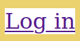
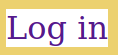

# Dia 1 - Dando vida ao projeto

> A pressa é a inimiga da vitória. O fraco não tem espaço e o covarde morre sem tentar!
> Racionais MC'c

## Exercício 05 - Criar HTML da seção
Aqui é uma ótimo oportunidade para você validar seu conhecimento sobre HTML que aprendeu nos exercícios do dia 1. Criaremos o título e subtítulo que fica a seguir do nosso cabeçalho.

### Tarefas
1. Crie o HTML do título que fica após o cabeçalho

2. Crie o HTML do subtítulo após o título que acabamos de criar


### Passo a passo

#### 1. Crie HTML do título
Após a tag `<header>` crie um tag de título de primeira importância (`<h1>`) e dentro dela coloque o conteúdo *Seems like we were not ready for that click* (Parece que não estávamos prontos para esse clique). O código que está dentro da sua tag `<body>` ficará da seguinte forma, com a adição do título:

```html
<header>
  <h1>Clic.ly</h1>

  <nav>
    <a href="">Home</a>
    <a href="">Pricing</a>
    <a href="">About Us</a>
    <a href="">Log in</a>
  </nav>
</header>

<h1>Seems like we were not ready for that click</h1>
```

#### 2. Crie HTML do subtítle
A seguir do título que acabamos de construtir, adicione uma tag que represente um título de segunda importância, também conhecido como subtítulo (`<h2>`) e dentro da dela coleque esse texto: *Well, let’s at least play a game?* (Bem, pelo menos vamos jogar um jogo?).
Seu código que está dentro do `<body>` ficará da seguinte forma:

```html
<header>
  <h1>Clic.ly</h1>

  <nav>
    <a href="">Home</a>
    <a href="">Pricing</a>
    <a href="">About Us</a>
    <a href="">Log in</a>
  </nav>
</header>

<h1>Seems like we were not ready for that click</h1>
<h2>Well, let’s at least play a game?</h2>
```

<div class="page"/>

## Exercício 02 - Base do CSS
Definiremos algumas bases para a parte visual do nosso site com CSS, cores da nossa aplicação suando variaveis do CSS e utilizaremos uma dela aplicando ela no `<body>`.

### Tarefas
1. Crie uma pasta **css** que ficará dentro da **src**;
2. Crie uma pasta **settings** que ficará dentro da **css**;
3. Crie um arquivo **color.css** na pasta **settings** com uma variável chamada `--color-primary` que terá o valor `#ecd16f`, não deixe de importar o arquivo no **404.html**;
4. Crie uma pasta **elements** dentro da **css**;
5. Crie um arquivo **base.css** e nele você deve atribuir a cor `--color-primary` como cor de fundo para o body.

### Passo a passo

#### 1. Crie pasta CSS
No terminal e dentro da pasta do projeto **jokempo**, entre na pasta **src**, usando o comando a seguir:

```bash
cd src
```

Crie a pasta **css**:

```bash
mkdir css
```

#### 2. Crie pasta settings
Dentro da pasta **css** e no terminal crie a pasta **settings**:

```bash
mkdir settings
```

#### 3. Crie arquivo color.css
Volte no VSCode e crie um arquivo chamada **color.css** que ficará dentro da pasta **settings** que acabamos de criar. Dentro arquivo crie o selector `:root` que representa a aplicação toda, dentro do seletor crie a variável `--color-primary` e atribua o hexadecimal `#ecd16f` que representa a cor amarela do nosso site. O código do arquivo **settings.css** ficará assim:

```css
:root {
  --color-primary: #ecd16f;
}
```

Entre no arquivo **404.html** e adicione a tag `<link>` para relacionar ele com o arquivo **color.css**, o **código dentro da tag `<head>`**, ficará da seguinte forma:

```html
<meta charset="utf-8">
<title>Clic.ly - Not found page</title>

<link rel="stylesheet" href="css/settings/color.css">
```

> O seletor `:root` é usado para criar recursos que pode ser acessado por qualquer outro seletor da nossa aplicação. Por isso que usamos ele para guardar nossas variáveis de cor, porque ela será usada pela aplicação toda em muitos contextos diferentes.

> Toda variável no CSS parece uma propriedade do CSS, por esse motivo é obrigatório ela começar com dois hifens (`--`), elas também são chamada de custom properties (propriedades customizadas). Você pode ler mais sobre na MDN (Mozilla develoer network): [https://developer.mozilla.org/en-US/docs/Web/CSS/--*](https://developer.mozilla.org/en-US/docs/Web/CSS/--*)

> Dentro da pasta **settings** ficará todas as variáveis que vamos disponibilizar para nossa aplicação. A estrutura de pasta que estamos usando é muito similar a uma padrão conhecido com o ITCSS (Inverted Triangle CSS). Recomendo você ler o post do Willian Justen para se aprofundar mais nesse tema: [https://willianjusten.com.br/organizando-seu-css-com-itcss/](https://willianjusten.com.br/organizando-seu-css-com-itcss/) 

#### 4. Crie pasta
Volte ao terminal e crie a pasta **elements** dentro da pasta **css**. Estando dentro da pasta **css** rode o comando a seguir:

```bash
mkdir css
```

#### 5. Crie arquivo base.css
No VSCode crie um arquivo **base.css** dentro da pasta **elements**, nele crie um seletor de tag para a `body`, no seletor defina a cor de fundo usando a propriedade `background-color` com o valor da variável `--color-primary`. O código do arquivo **base.css**, fica dessa forma:

```css
body {
  background-color: var(--color-primary);
}
```

> Para usar um variável do CSS precisamos envolvê-la com `var(--nome-da-variavel)`.

Importe o arquivo **base.css** no arquivo **404.html** usando a tag `<link>` dentro do `<head>` e após o importe do arquivo **color.css**. Seu código dentro da tag `<head>` ficará da seguinte forma:

```html
<meta charset="utf-8">
<title>Clic.ly - Not found page</title>

<link rel="stylesheet" href="css/settings/color.css">
<link rel="stylesheet" href="css/elements/base.css">
```

Se visitar o seu navegador a sua página estará similar a esta:


<div class="page"/>

## Exercício 03 - Primeiro componente
Não vou te ensinar a criar um CSS complicado de da manutenção,se você criar uma site, sistema ou aplicação que tem um custo alto de manutenção isso te trará muito frustação a curto prazo e poderá fazer com que o seu projeto venha a falha, um produto com custo alto se torna menos competivo no mercado de trabalho.
Então vamos criar o nosso primeiro componente e tudo que precisa para deixar nosso CSS organizado e de fácil manutenção.

### Tarefas
1. Crie uma pasta **components** dentro da pasta **css**;
2. Adicione a `class` `main-logo` no `<h1>` que está dentro da tag `<header>`
3. Crie um arquivo **main-logo.css** dentro da pasta **components** e faça o CSS para ele ficar assim (lembre-se do `<link>` para o arquivo **main-logo.css** no **404.html**):


### Passo a passo

#### 1. Crie pasta components
Agora não precisa mais usar o terminal para criar as pastas, acho que já pegou a ideia dele, pode criar a pasta **components** usando o próprio VSCode, essa pasta ficará dentro da past **css**.

#### 2. Adicione o main-logo
Adicone o atributo `class` com o valor `main-logo` na tag `<h1>` que esta dentro da tag `<header>` no nosso arquivo **404.html**:

```html
<h1 class="main-logo">Clic.ly</h1>
```

#### 3. CSS do componente main-logo
Dentro do arquivo **color.css** adicionar uma nova cor chamada `--color-second` e atribua a ela o valor de `#fff` que é o hexadecimal da cor branca:

```css
:root {
  --color-primary: #ecd16f;
  --color-second: #fff;
}
```

Dentro da pasta **components** crie um arquivo **main-logo.css**, nesse arquivo crie um seletor de classe chamado `main-logo`:

```css
.main-logo {
  
}
```

> Seletore de classes começam com um ponto (`.main-logo`), não esqueça do ponto porque isso é um seletor válido só que sem um ponto no começo ele se torna um seletor de tag

Dentro do seletor `.main-logo` adicione a cor branca para o texto usando a propriedade CSS `color` com o valor `var(--color-second)`:

```css
.main-logo {
  color: var(--color-second);
}
```

Faça o importe do arquivo **main-log.css** no arquivo **404.html** usando a tag `<link>`, ela ficará depois do relacionamento do arquivo **base.css**. O código que fica **dentro da sua tag `<head>`** ficará da assim:

```html
<meta charset="utf-8">
<title>Clic.ly - Not found page</title>

<link rel="stylesheet" href="css/settings/color.css">
<link rel="stylesheet" href="css/elements/base.css">

<link rel="stylesheet" href="css/components/main-logo.css">
```

Precisamos importantar nossa a família de font do nosso `.main-logo` que é a Bitter, usaremos o Google Fonts para baixar está família no nosso arquivo **404.html**, para isso também vamos usar uma tag `<link>` mas ela não está direcionada a um arquivo CSS e sim ao link da fonte Bitter no Google Fonts e a tag `<link>` dela ficará antes do arquivo **color.css** como está demostrado a seguir:

```html
<link href="https://fonts.googleapis.com/css?family=Bitter:400,400i,700&display=swap" rel="stylesheet"> 

<link rel="stylesheet" href="css/settings/color.css">
<link rel="stylesheet" href="css/elements/base.css">

<link rel="stylesheet" href="css/components/main-logo.css">
```

> Link para a fonte Bitter no Google Fonts: [https://fonts.google.com/specimen/Bitter](https://fonts.google.com/specimen/Bitter)

Abra o arquivo **main-logo.css**, aplique a fonte Bitter no seletor `.main-logo` usando a propriedade `font-family` com o valor `'Bitter', serif`:

```css
.main-logo {
  color: var(--color-second);
  font-family: 'Bitter', serif;
}
```

> A propriedade `font-family` aceita mais de um valor de fontes, ela da prioridade para fontes que estão a direita e caso a fonte não exista ou não funcione por algum motivo ela tenta carregar a próxima fonte, no final é recomendado usar `serif` (qualquer fonte serifada) ou `sans-serif` (qualquer fonte não serifada), para caso nenhum das fontes funcione, o SO (sistema operacional) irá recomendar uma fonte para o navegador.

> Nos componentes evitamos usar propriedade que finam altura, largura, espaços (respiros), posicionamento ou tamanho. Algumas propriedade que evitamos nos componentes são: `width`, `height`, `margin`, `padding`, `display`, `position` e `float`. Isso irá garantir uma maior flexibilidade do uso dos componentes por tanto uma manutenção mais feliz.

<div class="page"/>

## Exercício 4 - Componente simple-action
Criaremos o componente dos links que ficam na navegação principal do nosso site. Ele não usa a mesma família de fontes do nosso logo e é uma ótima oportunidade para praticar o conceito de componentes.

### Tarefas
1. Adicione a classe `simple-action` nos três primeiros na navegação principal do site; 
2. Crie o arquivo **simple-action.css** dentro da pasta **components**;
3. Implemente o CSS que deixará o componente com na imagem a seguir, dentro do arquivo **simple-action**:


### Passo a passo

#### 1. Adicone a classe simple-action
Dentro do arquivo **404.html** adicione o atributo `class` com o valor `simple-action` nas três primeiras tags `<a>` que estão dentro da tag `<nav>`. O **código da sua `<nav>`** ficará da seguinte forma:

```html
<nav>
  <a class="simple-action" href="">Home</a>
  <a class="simple-action" href="">Pricing</a>
  <a class="simple-action" href="">About Us</a>
  <a href="">Log in</a>
</nav>
```

#### 2. Crie arquivo simple-action.css
Dentro da pasta **components** que temos na pasta **css** adicione um novo arquivo **simple-action.css**, faça isso dentro do VSCode.

Abra o arquivo **404.html** e adicione a tag `<link>` que fará o importe do arquivo que acabamos de criar, essa tag ficará depois do importe do componente `main-logo`, o código que fica dentro do seu `<head>` ficará dessa forma:

```html
<meta charset="utf-8">
<title>Clic.ly - Not found page</title>

<link href="https://fonts.googleapis.com/css?family=Bitter:400,400i,700&display=swap" rel="stylesheet"> 

<link rel="stylesheet" href="css/settings/color.css">
<link rel="stylesheet" href="css/elements/base.css">

<link rel="stylesheet" href="css/components/main-logo.css">
<link rel="stylesheet" href="css/components/simple-action.css">
```

#### 3. CSS do simple-action
Crie o seletor de classes `.simple-action` dentro do arquivo **simple-action.css**:

```css
.simple-action {

}
```

Defina a cor branca para o texto do seletor `.simple-action` usando a propriedade `color` passando para ela a variável `--color-second`, o seletor ficará dessa forma:

```css
.simple-action {
  color: var(--color-second);
}
```

No navegador terá o seguinte resultado:


Remova o traço que fica na base do texto, usando a propriedade `text-decoration` com o valor `nome`:

```css
.simple-action {
  color: var(--color-second);
  text-decoration: none;
}
```

Esse é o resultado no navegador:


Abra o arquivo **404.html** e adicione a tag `<link>` a seguir da tag que realiza o importe da fonte Bitter essa nova tag irá importar a familía de fonte Comfortaa, o código que está dentro do seu `<head>` ficará assim:

```html
<meta charset="utf-8">
<title>Clic.ly - Not found page</title>

<link href="https://fonts.googleapis.com/css?family=Bitter:400,400i,700&display=swap" rel="stylesheet"> 
<link href="https://fonts.googleapis.com/css?family=Comfortaa:300,400,500,700&display=swap" rel="stylesheet"> 

<link rel="stylesheet" href="css/settings/color.css">
<link rel="stylesheet" href="css/elements/base.css">

<link rel="stylesheet" href="css/components/main-logo.css">
<link rel="stylesheet" href="css/components/simple-action.css">
```

Importe realizado, volte ao arquivo **simple-action.css** e aplique a fonte Comfortaa usando a propriedade `font-family` com o valor `font-family: 'Comfortaa', sans-serif`:

```css
.simple-action {
  color: var(--color-second);
  text-decoration: none;
  font-family: 'Comfortaa', sans-serif;
}
```

Você terá o seguinte resultado visual no navegador:


<div class="page"/>

## Exercício 05 - Componente primary-button
O componente primary-button terá um pouco mais de propriedades comparado com os outro dois que acabamos de criar e ele é um tipo de componente usado em muitos contexto dentro de um site, botões estão espalhos em sites da internet, não é mesmo!

### Tarefas
1. Coloque a classe `primary-button` no quarto link da navegação principal do nosso site;
2. Adicione um arquivo novo na pasta **componente** chamado **primary-button.css**;
3. Construa todo o CSS necessário no arquivo **primary-button.css** para o componente `primary-button` ficar similar a imagem a seguir, lembre-se das regras de um componente:


### Passo a passo

#### 1. Adicione classe primary-button
Abra o arquivo **404.html** e adicione o atributo `class` no quarto link do menu principal com o valor `primary-button`, a sua `<nav>` ficará assim:

```html
<nav>
  <a class="simple-action" href="">Home</a>
  <a class="simple-action" href="">Pricing</a>
  <a class="simple-action" href="">About Us</a>
  <a class="primary-button" href="">Log in</a>
</nav>
```
#### 2. Crie o arquivo primary-button.css
Pelo VSCode crie o arquivo **primary-button.css** dentro da pasta **components** que está localizada na pasta **css**.

Abra o arquivo **404.html** e adicione uma tag `<link>` que importará o arquivo que acabmos de criar, essa tag ficará após a tag o importe do componente **simple-action.css**, **dentro do seu `<head>`** você terá o seguinte código:

```html
<meta charset="utf-8">
<title>Clic.ly - Not found page</title>

<link href="https://fonts.googleapis.com/css?family=Bitter:400,400i,700&display=swap" rel="stylesheet"> 
<link href="https://fonts.googleapis.com/css?family=Comfortaa:300,400,500,700&display=swap" rel="stylesheet"> 

<link rel="stylesheet" href="css/settings/color.css">
<link rel="stylesheet" href="css/elements/base.css">

<link rel="stylesheet" href="css/components/main-logo.css">
<link rel="stylesheet" href="css/components/simple-action.css">
<link rel="stylesheet" href="css/components/primary-button.css">
```

#### 3. CSS do primary-button
Dentro do arquivo **primary-button.css** crie um seletor de classe para o componente `primary-button`:

```css
.primary-button {

}
```

Atribua a cor de fundo branca para o componente usando a propriedade `background-color` com o valor `var(--color-second)`:

```css
.primary-button {
  background-color: var(--color-second);
}
```

Veja no seu navegador:



Remova o traço sob o texto usando a propriedade `text-decoration` com o valor `none`:

```css
.primary-button {
  background-color: var(--color-second);
  text-decoration: none;
}
```

No navegador terá o seguinte resultado:



Defina a cor de texto para amarelo usando a propriedade `color` com o valor `var(--color-primary)`:

```css
.primary-button {
  background-color: var(--color-second);
  text-decoration: none;
  color: var(--color-primary);
}
```


Para adiconar bordar arredondadas utilize a proriedade `border-radius` com o valor `10px`:

```css
.primary-button {
  background-color: var(--color-second);
  text-decoration: none;
  color: var(--color-primary);
  border-radius: 10px;
}
```


