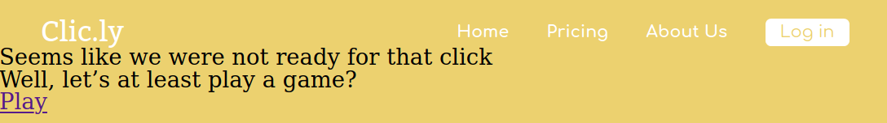

# Dia 03 - Treinando HTML e CSS

> *Busque o caminho, não um dedo que te aponte ele...*<br>
> Emicida

## Exercício 01 - Cross Browser com reset CSS
Quando você ouve alguém dizer: *Meu site é cross browser (desculpa não sei traduzir isso)*, essa pessoa está dizendo que o site funciona igual em todos os navegadores. No começo da internet nós tinhamos muitos problemas para manter um site funcionando em múltiplos navegadores e era muito comum você ver escrito no rodapé, algo como: **Site compatível com Internet Explorer**. Felizmente hoje em dia está cada vez mais fácil implementar um site *cross browser*.

O **reset CSS** é uma técnica que nós ajudará a implementar um site *cross browser*, ela é um arquivo chamado **reset.css**, nele teremos apenas seletores de tags, e nesses seletores definimos valores padrões para propriedades que variam entre os navegadores. Por conta disso o `<link>` do **reset.css** tem que vir depois dos importes do **settings**, caso contrário nós estaríamos sobreescrevendo o comportamento de alguns dos nossos componentes e containers. Se não ficou claro para você, fique tranquilo, praticando poderá sanar sua dúvidas, mas se após a prática, ficar algum dúvida não deixe de perguntar em um dos canais da CollabCode:

- [Discord](http://bit.ly/discord-collabcode)
- [Facebook](http://bit.ly/face-html-css-javascript)
- [Telegram](http://bit.ly/telegram-collabcode)

### Tarefas
1. Crie uma pasta **generic** dentro da **css**;
2. Crie um arquivo **reset.css** dentro da pasta **generic**;
3. Dentro do **reset.css** aplique o reset do Eric Meyer. 

### Passo a passo

#### 1. Crie pasta generic
Dentro da pasta **css** crie uma pasta **generic**, dentro dela terá arquivos com seletores CSS com pouco valor de especifidade e é muito comum colocarmos nela o **reset.css**.

#### 2. Crie arquivo reset.css
Crie um novo arquivo **reset.css** e coloque na pasta **generic**.

Abra o arquivo **404.html** e adicione uma tag `<link>` para o **reset.css**, essa tag ficará depois do ultimo importe dos arquivos da pasta **settings**, as tags `<link>` que você tem **dentro do seu `<head>`** ficarão assim:

<div class="page"/>

```html
<link href="https://fonts.googleapis.com/css?family=Bitter:400,400i,700&display=swap" rel="stylesheet"> 
<link href="https://fonts.googleapis.com/css?family=Comfortaa:300,400,500,700&display=swap" rel="stylesheet"> 

<link rel="stylesheet" href="css/settings/color.css">
<link rel="stylesheet" href="css/settings/gap.css">
<link rel="stylesheet" href="css/generic/reset.css">
<link rel="stylesheet" href="css/elements/base.css">

<link rel="stylesheet" href="css/components/main-logo.css">
<link rel="stylesheet" href="css/components/simple-action.css">
<link rel="stylesheet" href="css/components/primary-button.css">

<link rel="stylesheet" href="css/containers/main-menu.css">
<link rel="stylesheet" href="css/containers/main-header.css">
```

#### 3. Reset CSS Eric Meyer
Você pode criar o seu próprio código do **reset.css** mas felizmente a comunidade já fez isso algumas vezes, por esse motivo vamos usar o reset do Eric Meyer. Entre no site a seguir, copie o código do reset CSS e depois cole no seu arquivo **reset.css**. Seu **reset.css** ficará similar ao a seguir, mas por favor use o que está no site porque o que está na apostila pode estar desatualizado.

Site para copiar o reset CSS do Eric Meyer: [https://meyerweb.com/eric/tools/css/reset/](https://meyerweb.com/eric/tools/css/reset/)

<div class="page"/>

```css
/* http://meyerweb.com/eric/tools/css/reset/ 
   v2.0 | 20110126
   License: none (public domain)
*/

html, body, div, span, applet, object, iframe,
h1, h2, h3, h4, h5, h6, p, blockquote, pre,
a, abbr, acronym, address, big, cite, code,
del, dfn, em, img, ins, kbd, q, s, samp,
small, strike, strong, sub, sup, tt, var,
b, u, i, center,
dl, dt, dd, ol, ul, li,
fieldset, form, label, legend,
table, caption, tbody, tfoot, thead, tr, th, td,
article, aside, canvas, details, embed, 
figure, figcaption, footer, header, hgroup, 
menu, nav, output, ruby, section, summary,
time, mark, audio, video {
	margin: 0;
	padding: 0;
	border: 0;
	font-size: 100%;
	font: inherit;
	vertical-align: baseline;
}
/* HTML5 display-role reset for older browsers */
article, aside, details, figcaption, figure, 
footer, header, hgroup, menu, nav, section {
	display: block;
}
body {
	line-height: 1;
}
ol, ul {
	list-style: none;
}
blockquote, q {
	quotes: none;
}
blockquote:before, blockquote:after,
q:before, q:after {
	content: '';
	content: none;
}
table {
	border-collapse: collapse;
	border-spacing: 0;
}
```

<div class="page"/>

Visite o seu site no navegador e terá uma grande surpresa:


<div class="page"/>

## Exercício 02 - Arrume container main-header
Com a inserção do **reset.css** o container `main-header` está sem *gap* nos lados esquerdo, direito e no topo.

### Tarefas
1. Dentro do **gap.css** crie os novos gaps que usaremos no `main-header`;
2. Use os gaps criados no `main-header`, conforme na imagem a seguir:


### Passo a passo

#### 1. Novos gaps
No arquivo **gap.css** crie uma variável `--gap-smaller` e atribua o valor de `15px`:

```css
:root {
  --gap-smaller: 15px;
  --gap-small: 22px;
}
```

Adicione uma outra variável `--gap-medium` com o valor de `30px`:

```css
:root {
  --gap-smaller: 15px;
  --gap-small: 22px;
  --gap-medium: 30px;
}
```

#### 2. Use gaps no main-header
Abra o arquivo CSS do container `main-header` (**main-header.css**) e adicione a propriedade `padding` com o valor `var(--gap-smaller) var(--gap-smaller) 0` no seletor `.main-header`, dessa forma teremos de volta o respiro do container em relação a página nos lados superior, direito e esquerdo. O código do arquivo ficará assim:

<div class="page"/>

```css
.main-header {
  display: flex;
  align-items: center;
  justify-content: space-between;
  padding: var(--gap-smaller) var(--gap-medium) 0;
}

.main-header > .main-logo {
  font-size: 20px;
}
```

O resultado do site no navegador ficará assim:


<div class="page"/>

## Exercício 03 - Finalize HTML da seção
A seguir do nosso cabeçalho temos uma seção, já começamos a implementar o HTML dela, nesse momento está faltando o HTML de um botão e de um link, faremos os dois agora.

### Tarefas
1. No arquivo **404.html** adicione o HTML do botão;
2. Adicione o HTML do link;
3. Use uma tag para envolver todo o conteúdo dessa seção, conforme mostrado na imagem a seguir:


### Passo a passo

#### 1. Crie HTML do botão
No arquivo **404.html** adicione uma nova tag `<a>` com o conteúdo `Play`, ela ficará a seguir da tag `<h2>`. O código do seu `<body>` ficará assim:

```html
<header class="main-header">
  <h1 class="main-logo">Clic.ly</h1>

  <nav class="main-menu">
    <a class="simple-action" href="">Home</a>
    <a class="simple-action" href="">Pricing</a>
    <a class="simple-action" href="">About Us</a>
    <a class="primary-button" href="">Log in</a>
  </nav>
</header>

<h1>Seems like we were not ready for that click</h1>
<h2>Well, let’s at least play a game?</h2>
<a href="">Play</a>
```

O resultado no navegador será:



Após o link que acabamos de inserir colocaremos uma nova tag `<a>` como texto `Go Home`:

```html
<header class="main-header">
  <h1 class="main-logo">Clic.ly</h1>

  <nav class="main-menu">
    <a class="simple-action" href="">Home</a>
    <a class="simple-action" href="">Pricing</a>
    <a class="simple-action" href="">About Us</a>
    <a class="primary-button" href="">Log in</a>
  </nav>
</header>

<h1>Seems like we were not ready for that click</h1>
<h2>Well, let’s at least play a game?</h2>
<a href="">Play</a>
<a href="">Go Home</a>
```

Agora crie uma tag `<section>` que envolverá as 4 tags (`<h1>`, `<h2>` e as duas `<a>`), dessa forma estaremos dizendo ao navegador que essas 4 tags estão relacionadas. Dentro do seu `<body>` você terá o seguinte conteúdo:

```html
<section>
  <h1>Seems like we were not ready for that click</h1>
  <h2>Well, let’s at least play a game?</h2>
  <a href="">Play</a>
  <a href="">Go Home</a>
</section>
```

<div class="page"/>

## Exercício 04 - Crie o componente simple-title
Nós já implementamos todo HTML da seção que fica após o cabeçalho, agora vamos seguir a mesma técnica que fizemos no cabeçalho, onde começamos criando os componentes que estão dentro de um mesmo container e só depois partimos para criação do container em si.

### Tarefas
1. Crie o arquivo **simple-title.css** dentro da pasta **components**;
2. Crie a variável de cor `--color-base` com a cor usada no texto do componente `simple-title`;
3. Adicione a class `simple-title` na tag `<h1>` da `<section>`;
3. Crie o CSS necessário para o componente ficar assim:


### Passo a passo

#### 1. Crie arquivo simple-title
Dentro da pasta **css** tem uma pasta **components**, nela crie um arquivo **simple-title.css**.

Abra o **404.html** e no `<head>` adicione uma tag `<link>` que fará o importe do arquivo que acabamos de criar, essa tag ficará depois do importe do componente **primary-button**. As tags `<link>`s que estão dentro do seu `<head>` ficarão assim:

```html
<link href="https://fonts.googleapis.com/css?family=Bitter:400,400i,700&display=swap" rel="stylesheet"> 
<link href="https://fonts.googleapis.com/css?family=Comfortaa:300,400,500,700&display=swap" rel="stylesheet"> 

<link rel="stylesheet" href="css/settings/color.css">
<link rel="stylesheet" href="css/settings/gap.css">
<link rel="stylesheet" href="css/generic/reset.css">
<link rel="stylesheet" href="css/elements/base.css">

<link rel="stylesheet" href="css/components/main-logo.css">
<link rel="stylesheet" href="css/components/simple-action.css">
<link rel="stylesheet" href="css/components/primary-button.css">
<link rel="stylesheet" href="css/components/simple-title.css">

<link rel="stylesheet" href="css/containers/main-menu.css">
<link rel="stylesheet" href="css/containers/main-header.css">
```

#### 2. Crie a --color-base
No arquivo **color.css** crie uma variável chamada `--color-base` e atribua o valor `#333333`. O código desse arquivo ficará assim:

```css
:root {
  --color-base: #333333;
  --color-primary: #ecd16f;
  --color-second: #fff;
}
```

#### 3. Adicione class simple-title
Abra o arquivo **404.html** dentro do `<body>` tem uma `<section>` que tem um `<h1>`, nele adicione o atributo `class` com o valor `simple-title` e dessa forma ele ganhará todos comportamentos visuais que definirmos para o componente `simple-title`. O código da `<section>` que está **dentro do seu `<body>`** ficará assim:

```html
<section>
  <h1 class="simple-title">Seems like we were not ready for that click</h1>
  <h2>Well, let’s at least play a game?</h2>
  <a href="">Play</a>
  <a href="">Go Home</a>
</section>
```

#### 4. Crie CSS do simple-title
Dentro do arquivo **simple-title.css** crie um seletor de classe do componente `simple-title`:

```css
.simple-title {
  
}
```

Defina uma cor para o texto do componente `simple-title` usando a propriedade `color` com o valor `var(--color-base)`:

```css
.simple-title {
  color: var(--color-base);
}
```

O resultado visual no navegador será:


Utilize a propriedade `font-family` como valor `'Bitter', serif` para alterar a família de fonte do componente:

```css
.simple-title {
  color: var(--color-base);
  font-family: 'Bitter', serif;
}
```

No seu navegador você verá:


Deixe o texto do componente em negrito usando a propriedade `font-weight` com o valor `bold`:

```css
.simple-title {
  color: var(--color-base);
  font-family: 'Bitter', serif;
  font-weight: bold;
}
```

Esse é o resultado no navegador:


<div class="page"/>

## Exercício 05 - Crie o componente simple-subtitle
Criar componente daqui a pouco será algo simples e feliz para você. Lembre-se de evitar propriedades de posicionamento, tamanho ou espaços em seus componentes, isso deixará eles muito mais reutilizáveis.

### Tarefas
1. Crie o arquivo **simple-subtitle.css** dentro da pasta **components**;
2. Adicione a classe `simple-subtitle` na tag `<h2>` da `<section>`;
3. Crie o CSS necessário para o componente ficar assim:


### Passo a passo

#### 1. Crie arquivo simple-subtitle
Dentro da pasta **components** localizada na pasta **css** crie um arquivo chamado **simple-subtitle.css**.

No seu **404.html** adicione uma nova tag `<link>` que fará o relacionamento do arquivo **simple-subtitle.css**, ela ficará após o importe do componente `simple-title`. As tags `<link>` ficam assim:

```html
<link href="https://fonts.googleapis.com/css?family=Bitter:400,400i,700&display=swap" rel="stylesheet"> 
<link href="https://fonts.googleapis.com/css?family=Comfortaa:300,400,500,700&display=swap" rel="stylesheet"> 

<link rel="stylesheet" href="css/settings/color.css">
<link rel="stylesheet" href="css/settings/gap.css">
<link rel="stylesheet" href="css/generic/reset.css">
<link rel="stylesheet" href="css/elements/base.css">

<link rel="stylesheet" href="css/components/main-logo.css">
<link rel="stylesheet" href="css/components/simple-action.css">
<link rel="stylesheet" href="css/components/primary-button.css">
<link rel="stylesheet" href="css/components/simple-title.css">
<link rel="stylesheet" href="css/components/simple-subtitle.css">

<link rel="stylesheet" href="css/containers/main-menu.css">
<link rel="stylesheet" href="css/containers/main-header.css">
```

#### 2. Adicione a class simple-subtitle
Abra o arquivo **404.html** e dentro dele procure a tag `<section>`, dentro dela terá uma tag `<h2>`, nela adicione o atributo `class` com o valor `simple-subtitle`. A tag `<section>` e todo código dela ficará assim:

<div class="page"/>

```html
<section>
  <h1 class="simple-title">Seems like we were not ready for that click</h1>
  <h2 class="simple-subtitle">Well, let’s at least play a game?</h2>
  <a href="">Play</a>
  <a href="">Go Home</a>
</section>
```

#### 3. Crie CSS do componente simple-subtitle
No arquivo **simple-subtitle.css** adicione o seletor de classe para `simple-subtitle`:

```css
.simple-subtitle {
  
}
```

Adicione a propriedade `color` com o valor `var(--color-base)` para alterar a cor do texto do componente `simple-subtitle`:

```css
.simple-subtitle {
  color: var(--color-base);
}
```
O resultado no seu navegador será: 


Para mudar a família de fonte do componente `simple-subtitle` utilize a propriedade `font-family` com o valor `'Bitter', serif`:

```css
.simple-subtitle {
  color: var(--color-base);
  font-family: 'Bitter', serif;
}
```

<div class="page"/>

Visite seu navegador e verá:


<div class="page"/>

## Exercício 06 - Primeira variação do componente
Vamos reutilizar o componente `primary-button` que hoje é usado apenas no cabeçalho dessa forma:


E adicionar o CSS necessário para o mesmo componente funcionar também desta maneira:


Nós queremos reaproveitar a maior parte dos comportamentos visuais que já existem no componente `primary-button`, o que vamos tratar de forma diferente é a cor do texto e a família de fonte, chamamos isso de **variação**. Vamos aprender a criar uma variação para nosso componente na prática:

### Tarefas
1. Adicione a classe `primary-button` na primeira tag `<a>` que está dentro da `<section>`;
2. Adicione também a classe de variação `-dark` na mesma tag que acabou de adiconar o `primary-button`;
3. Crie o CSS da variação `-dark`.

### Passo a passo

#### 1. Adicione a classe primary-button
Dentro do arquivo **404.html** tem a tag `<section>` que contém uma `<a>` com o conteúdo *Play* (começar), adicione nela o atributo `class` com o valor `primary-button`. O código da `<section>` e de seus filhos, ficará assim:

```html
<section>
  <h1 class="simple-title">Seems like we were not ready for that click</h1>
  <h2 class="simple-subtitle">Well, let’s at least play a game?</h2>
  <a class="primary-button" href="">Play</a>
  <a href="">Go Home</a>
</section>
```

O resultado visual será:


#### 2. Adicione a classe de variação -dark
Toda classe de variação que muda o comportamento padrão de um componente começa com um hífen (-), isso ajuda a leitura do código. Dentro da tag `<a>` que acabamos de adicionar a classe `primary-button` adicione também a classe de variação `-dark`. O resultado do código da `<section>` é esse:

```html
<section>
  <h1 class="simple-title">Seems like we were not ready for that click</h1>
  <h2 class="simple-subtitle">Well, let’s at least play a game?</h2>
  <a class="primary-button -dark" href="">Play</a>
  <a href="">Go Home</a>
</section>
```

Apesar de adicionarmos a classe de variação nada mudou no navegador, isso porque não definimos nenhum comportamento para essa classe no CSS do componente.

#### 3. CSS da variação -dark
Dentro do arquivo **primary-button.css** adicione um seletor que procurará um elemento HTML que tenha duas classes a `primary-button` e a `-dark`, para isso nosso seletor ficará assim: `.primary-button.-dark`.
Repare que no seletor nós temos as duas classes mas não tem nenhum espaço entre elas, isso significa que estamos procurando um elemento que possua as duas ao mesmo tempo. O código do arquivo **primary-button.css** ficará assim:

```css
.primary-button {
  background-color: var(--color-second);
  text-decoration: none;
  color: var(--color-primary);
  border-radius: 4px;
  font-family: 'Comfortaa', sans-serif;
}

.primary-button.-dark {
  
}
```

No seletor que acabamos de criar adicione a propriedade `color` com o valor `var(--color-base)`, dessa forma a variação terá o texto na cor cinza:

<div class="page"/>

```css
.primary-button {
  background-color: var(--color-second);
  text-decoration: none;
  color: var(--color-primary);
  border-radius: 4px;
  font-family: 'Comfortaa', sans-serif;
}

.primary-button.-dark {
  color: var(--color-base);
}
```

Resultado no navegador:


Adicione a propriedade `font-family` com o valor `'Bitter', serif`, para mudar a família de fonte, essa propriedade tem que ser adicionada no seletor da variação do componente que é: `.primary-button.-dark`.

```css
.primary-button {
  background-color: var(--color-second);
  text-decoration: none;
  color: var(--color-primary);
  border-radius: 4px;
  font-family: 'Comfortaa', sans-serif;
}

.primary-button.-dark {
  color: var(--color-base);
  font-family: 'Bitter', serif;
}
```

Esse é o resultado visual no navegador:


Use a propriedade `font-weight` com o valor `bold` para deixar a fonte em negrito na variação `-dark` do nosso componente `primary-button`:

<div class="page"/>

```css
.primary-button {
  background-color: var(--color-second);
  text-decoration: none;
  color: var(--color-primary);
  border-radius: 4px;
  font-family: 'Comfortaa', sans-serif;
}

.primary-button.-dark {
  color: var(--color-base);
  font-family: 'Bitter', serif;
  font-weight: bold;
}
```

Seu componente `primary-button` que usa a variação `-dark` terá esse resultado no navegador:


<div class="page"/>

## Exercício 07 - Variação do componente simple-action
Criaremos um variação chamada `-light` para o componente `simple-action`.

### Tarefas
1. Crie uma variável `--color-base-light` com a cor do texto da variação;
2. Adicione a classe `simple-action` na segunda tag `<a>` que está dentro da `<section>`;
3. Adicione também a classe de variação `-light` na mesma tag que acabou de adicionar o `simple-action`;
4. Crie o CSS da variação `-light` para ficar como na imagem a seguir:


### Passo a passo

#### 1. Crie a --color-base-light
Dentro do arquivo **color.css** adicione uma nova variável `--colo-base-light` com o valor `rgba(51, 51, 51, 0.4)`. O código do arquivo ficará assim:

```css
:root {
  --color-base: #333333;
  --color-base-light: rgba(51, 51, 51, 0.4);
  --color-primary: #ecd16f;
  --color-second: #fff;
}
```

#### 2. Adicione a classe simple-action
Na segunda tag `<a>` que temos dentro da tag `<section>` adicione a o atributo `class` com o valor `simple-action`, para ela ganhar todos comportamentos do componente `simple-action`. O código da tag `<section>` ficará assim:

```html
<section>
  <h1 class="simple-title">Seems like we were not ready for that click</h1>
  <h2 class="simple-subtitle">Well, let’s at least play a game?</h2>
  <a class="primary-button -dark" href="">Play</a>
  <a class="simple-action" href="">Go Home</a>
</section>
```

Esse será o resultado no navegador:


#### 3. Adicione a variação -light
Na mesma tag que acabamos de adicionar a classe `simple-action` adicione também a classe `-light`. O código da `<section>` fica assim:

```html
<section>
  <h1 class="simple-title">Seems like we were not ready for that click</h1>
  <h2 class="simple-subtitle">Well, let’s at least play a game?</h2>
  <a class="primary-button -dark" href="">Play</a>
  <a class="simple-action -light" href="">Go Home</a>
</section>
```

#### 4. Crie CSS da -light
Abra o arquivo **simple-action.css** e adicione o seletor que procurará um elemento que tenha duas classes ao mesmo tempo, a `simple-action` e a classe de variação `-light`. O código do arquivo do componente `simple-action` ficará assim:

```css
.simple-action {
  color: var(--color-second);
  text-decoration: none;
  font-family: 'Comfortaa', sans-serif;
  font-weight: bold;
}

.simple-action.-light {
  
}
```

Use a propriedade `font-family` como valor `'Bitter', serif` para alterar a família de fonte da variação `-light` do componente `simple-action`:

<div class="page"/>

```css
.simple-action {
  color: var(--color-second);
  text-decoration: none;
  font-family: 'Comfortaa', sans-serif;
  font-weight: bold;
}

.simple-action.-light {
  font-family: 'Bitter', serif;
}
```

O resultado no navegador será esse: 


Mude a cor do texto dentro da variação `-light` usando a propriedade `color` com o valor `var(--color-base-light)`:

```css
.simple-action {
  color: var(--color-second);
  text-decoration: none;
  font-family: 'Comfortaa', sans-serif;
  font-weight: bold;
}

.simple-action.-light {
  font-family: 'Bitter', serif;
  color: var(--color-base-light);
}
```

Resultado no navegador é esse aqui:


<div class="page"/>

## Exercício 08 - Criar container main-stage
Criaremos o container responsável por posicionar todos os componentes que estão dentro da `<section>` em seus devidos lugares, o nome dele será `main-stage` (palco principal).

### Tarefas 
1. Crie a variável `--gap-big` com o valor do espaço entre o `simple-subtitle` e o `primary-button`;
2. Crie o arquivo **main-stage.css**;
3. Adicione a classe `main-stage` na `<section>`;
4. Crie o CSS necessário do container `main-stage` para deixar ele assim:


### Passo a passo

#### 1. Crie variável --gap-big
Dentro do arquivo **gap.css** crie uma nova variável `--gap-big` com o valor de `60px`. O código do arquivo ficará assim:

```css
:root {
  --gap-smaller: 15px;
  --gap-small: 22px;
  --gap-medium: 30px;
  --gap-big: 60px;
}
```

#### 2. Crie o arquivo **main-stage.css**
Dento da pasta **containers** crie o arquivo **main-stage.css**.

Abra o arquivo **404.html** e adicione uma nova tag `<link>` que será responsável pelo importe do arquivo **main-stage.css**, essa tag ficará depois da tag `<link>` do container `main-header`. As tags `<link>`s que estão dentro do `<head>` ficarão assim:

<div class="page"/>

```html
<link href="https://fonts.googleapis.com/css?family=Bitter:400,400i,700&display=swap" rel="stylesheet"> 
<link href="https://fonts.googleapis.com/css?family=Comfortaa:300,400,500,700&display=swap" rel="stylesheet"> 

<link rel="stylesheet" href="css/settings/color.css">
<link rel="stylesheet" href="css/settings/gap.css">
<link rel="stylesheet" href="css/generic/reset.css">
<link rel="stylesheet" href="css/elements/base.css">

<link rel="stylesheet" href="css/components/main-logo.css">
<link rel="stylesheet" href="css/components/simple-action.css">
<link rel="stylesheet" href="css/components/primary-button.css">
<link rel="stylesheet" href="css/components/simple-title.css">
<link rel="stylesheet" href="css/components/simple-subtitle.css">

<link rel="stylesheet" href="css/containers/main-menu.css">
<link rel="stylesheet" href="css/containers/main-header.css">
<link rel="stylesheet" href="css/containers/main-stage.css">
```

#### 3. Adicione main-stage
No **404.html** tem um tag `<section>` atribua para ela o atributo `class` com o valor `main-stage`. O código da `<section>` ficará assim:

```html
<section class="main-stage">
  <h1 class="simple-title">Seems like we were not ready for that click</h1>
  <h2 class="simple-subtitle">Well, let’s at least play a game?</h2>
  <a class="primary-button -dark" href="">Play</a>
  <a class="simple-action -light" href="">Go Home</a>
</section>
``` 

#### 4. CSS do container main-stage
Dentro do arquivo **main-stage.css** crie o seletor da classe `main-stage`. O código do arquivo ficará assim:

```css
.main-stage {

}
```

Adicione a propriedade `display` com o valor `flex` para trabalharmos com o alinhamento dos componentes que estão dentro do container:

<div class="page"/>

```css
.main-stage {
  display: flex;
}
```

Resultado no navegador:


Use a propriedade `flex-direction` com o valor `column` para deixar s componentes do nosso container um abaixo do outro:

```css
.main-stage {
  display: flex;
  flex-direction: column;
}
```

O resultado no navegador é esse: 


Centralize todos os componentes do container `main-stage` no sentido horizontal (eixo x) usando a propriedade `align-items` com o valor `center`:

```css
.main-stage {
  display: flex;
  flex-direction: column;
  align-items: center;
}
```

Como está no navegador:


Para centralizar os componentes no sentido vertical utilize a propriedade `justify-content` com o valor `center`:

```css
.main-stage {
  display: flex;
  flex-direction: column;
  align-items: center;
  justify-content: center;
}
```

Atualize o navegador e você terá uma triste surpresa, nada mudou:


Não tivemos alteração visual, usando a propriedade `justify-content` com o valor `center` porque o container `main-stage` não tem uma altura definida, por tantdo use a propriedade `height` com o valor `80vh`:

```css
.main-stage {
  display: flex;
  flex-direction: column;
  align-items: center;
  justify-content: center;
  height: 80vh;
}
```

Agora sim eles estão centralizado no sentido vertical:


