# Sumário

0. Introdução
    1. Objetivo
    1. Onde tirar dúvidas
    1. Como funciona o livro?
    1. Onde acessar o layout do projeto?
    1. Gostou, faça uma doação!
1. Dia 1 - Onde tudo começa
    1. Exercício 00 - Prepare o ambiente
    1. Exercício 01 - Inicie projeto
    1. Exercício 02 - Crie o HTML do cabeçalho
    1. Exercício 03 - Estruture o HTML
    1. Exercício 04 - Projeto no GitHub
    1. Desafios top top top
2. Dia 2 - Dando vida ao projeto
    1. Exercício 01 - Criar HTML da seção
    1. Exercício 02 - Base do CSS
    1. Exercício 03 - Primeiro componente
    1. Exercício 04 - Componente simple-action
    1. Exercício 05 - Componente primary-button
    1. Exercício 06 - Primeiro container
    1. Exercício 07 - Container main-menu
    1. Desafios top top top
3. Dia 3 - Treinando HTML e CSS
    1. Exercício 01 - Cross Browser com reset CSS
    1. Exercício 02 - Arrume container main-header
    1. Exercício 03 - Finalize HTML da seção
    1. Exercício 04 - Crie o componente simple-title
    1. Exercício 05 - Crie o componente simple-subtitle
    1. Exercício 06 - Primeira variação do componente
    1. Exercício 07 - Variação do componente simple-action
    1. Exercício 08 - Criar container main-stage
    1. Desafios top top top

<div class="page"/>

# Introdução

Salve (um oi, da periferia de São Paulo)! Tudo bom? Prazer, sou Marco Bruno. Esse livro é free (grátis) e você pode piratear ele à vontade, só não tenta ganhar uns trocados (dinheiro) em cima dele, certo?

## Objetivo

Quero trocar o conhecimento com você sobre **HTML**, **CSS** e **JavaScrit** para você começar seus estudos para o objetivo de ser Developer FrontEnd (pessoa desenvolvedora frontend).

## Onde tirar dúvidas

Todas as suas dúvidas podem ser tiradas nos canais a seguir. Criei um grupo no facebook como uma tentativa de ajudar a galera dos países da África que falam português (Angola, Cabo Verde, Guiné-Bissau, Moçambique, São Tomé e Príncipe e Guiné Equatorial) assim como nós brasileiros e por favor, não envie imagens, vídeos ou links externos porque a galera da África não tem um acesso à internet bom e o que tem é muito caro. É sério! Se alguém está com dúvida no grupo do facebook, por favor responda em texto e direto no facebook, ou simplesmente não responda, deixe para quem tem um bom coração.

- [Discord](http://bit.ly/discord-collabcode)
- [Facebook](http://bit.ly/face-html-css-javascript)
- [Telegram](http://bit.ly/telegram-collabcode)

## Como funciona o livro?

Cada capítulo é um dia de estudo, recomendo você não fazer mais de um capítulo por dia pois é importante deixar a mente respirar para você absorver o conhecimento de forma mais eficiente e feliz.
Esse livro é totalmente prático, é composto só com exercícios.
A **primeira parte** do exercício é chamado de **Tarefas**, que é apenas uma descrição do que deve ser feito. Se está assistindo as vídeo aulas ao vivo pela [twitch.tv/marcobrunobr](https://twitch.tv/marcobrunobr), recomendo você tentar fazer o exercício apenas com as informações passadas na **Tarefas**. Se após uns 5 minutos não conseguir executar o exercício ou em algum momento do exercício travar, você poderá consultar a segunda parte do exercício.

A **segunda parte** é chamada de **Passo a passo**, aqui mostro uma das formas de você chegar no que foi solicitado nas **Tarefas**. Se você finalizou o exercício seguindo apenas as instruções das **Tarefas** é provável que seu código esteja diferente do apresentado no **Passo a passo** e essa é uma das belezas da programação, não existe um único caminho para solucionar um problema. Seja livre e crítico de forma construtiva com você e todos, não considere que o meu código é melhor que o seu, diferente não é pior.
No final de toda capítulo tem os **Desafios top top top**, esses desafios é para você validar como está absorvendo o conhecimento das aulas.

Pronto! Agora vai para o seu Dia 1 e se ficar com alguma dúvida fique à vontade para entrar no [Discord](http://bit.ly/discord-collabcode), [Facebook](http://bit.ly/face-html-css-javascript) e [Telegram](http://bit.ly/telegram-collabcode).

<div class="page"/>

## Onde acessar o layout do projeto?

O layout utilizado nesse projeto não foi criado pela comunidade CollabCode, infelizmente não consegui achar o dono dele, caso você consiga por favor não deixe de nos avisar para lhe dar os devidos créditos. Você pode acessar o layout no link a seguir do Figma, é necessário você realizar um cadastro no Figma para ter acesso completo ao layout:

[https://www.figma.com/file/CywyY7njNGI6SfxbDnBOiW/404_error_page?node-id=0%3A25](https://www.figma.com/file/CywyY7njNGI6SfxbDnBOiW/404_error_page?node-id=0%3A25)

## Gostou, faça uma doação!

Gostou do eBook que a CollabCode criou, você pode tornar mais conteúdos como esse possíveis, ajudando a CollabCode, entre no link a seguir do PicPay e escolha o seu Plano:

[PicPay da CollabCode](http://bit.ly/picpay-collabcode)

<div class="page"/>

# Dia 1 - Onde tudo começa

> *Não precisa sofrer pra saber o que é melhor pra você*<br>
> Parte da música [Não Existe Amor Em SP](https://www.letras.mus.br/criolo/1857556/) de Criolo

## Exercício 00 - Prepare o ambiente
Nesse exercício instalaremos tudo que precisamos para começar nosso estudos em **HTML**, **CSS** e **JavaScript**. Será instalado um editor de texto (*Visual Studio Code* - Estúdio visual de código), um browser (navegador) que será o Fifefox Developer (navegador criado pela Mozilla para pessoas desenvolvedoras) e o Git (sistema de versionamento de código).
O *Visual Studio Code* também conhecido como *VSCode* é o editor de texto mais usado no mercado de trabalho, Firefox Developer é um dos navegadores mais usados pelas pessoas desenvolvedoras e o Git é de longe o sistema de versionamento mais utilizado no mercado de trabalho.

### Tarefas
Entre no sites a seguir e instale o VSCode, o Firefox Developer e o Git:
1. [https://code.visualstudio.com](https://code.visualstudio.com/)
1. [https://www.mozilla.org/en-US/firefox/developer](https://www.mozilla.org/en-US/firefox/developer/)
1. [https://git-scm.com/book/pt-br/v2/Come%C3%A7ando-Instalando-o-Git](https://git-scm.com/book/pt-br/v2/Come%C3%A7ando-Instalando-o-Git)


### Passo a passo
#### 1. Instalar o VSCode

Entre no site [https://code.visualstudio.com](https://code.visualstudio.com/) faça o download (baixar um arquivo) para o SO (Sistema Operacional) que você está usando e em seguida instale-o, se tiver qualquer problema com a instalação não deixe de pedir ajuda em um dos canais da comunidade CollabCode:

- [Discord](http://bit.ly/discord-collabcode)
- [Facebook](http://bit.ly/face-html-css-javascript)
- [Telegram](http://bit.ly/telegram-collabcode)

#### 2. Instalar o Firefox Developer

Acesse o site [https://www.mozilla.org/en-US/firefox/developer](https://www.mozilla.org/en-US/firefox/developer/) realize o download para o SO que você está usando, em seguida faça a instalação, tendo qualquer dúvida fique à vontade mandar suas dúvidas em um dos [canais da CollabCode](01-introducao.md#onde-tirar-dúvidas).

#### 3. Instalar Git

Acesso o eBook do Git no site [https://git-scm.com/book/pt-br/v2/Come%C3%A7ando-Instalando-o-Git](https://git-scm.com/book/pt-br/v2/Come%C3%A7ando-Instalando-o-Git) que lá terá todo processo de download e instalação para o SO que você estiver usando. Ficou com alguma dúvida não deixe de perguntar.

<div class="page"/>

## Exercício 01 - Inicie projeto

### Tarefas
1. Pelo terminal, crie uma pasta com o nome **jokempo** (sem acentuação mesmo) no Desktop (área de trabalho) do seu SO ou em outro lugar que você lembrará que ela estará lá;
1. Entre na pasta do seu projeto usando o terminal e inicie o Git dentro dela;
1. Dentro da pasta **jokempo** crie um pasta **src** (abreviação de source que significa fonte).

### Passo a passo
#### 1. Crie pasta do projeto

Abra o terminal do seu SO, se estiver no Windows use o Power Shell, Git BASH ou similares para que o comando do Linux funcione. Se estiver no Linux ou Mac, ambos têm comandos muitos similares. Agora que você já está com o seu terminal aberto vamos executar os seguintes passos:

Entre no Desktop com o comando a seguir:
```bash
cd ~/Desktop
```

Criar uma pasta chamada **jokempo** dentro do Desktop:
```bash
mkdir jokempo
```

Acessar a pasta **jokempo**:
```bash
cd jokempo
```

> Caso você tenha criado uma pasta com o nome errado você pode usar o comando `rm -r nomeDaPasta` para excluir a pasta e aí só precisa criá-la novamente ou ainda o comando `mv nomeDaPastaErrado nomeDaPastaCerto` para renomear.

#### 2. Iniciar Git

No terminal e dentro da pasta **jokempo** execute o comando a seguir, esse comando criará uma pasta oculta no seu projeto chamada **.git** (toda pasta e arquivos que começam com um ponto são ocultas). Dentro desta pasta ficará tudo sobre o Git que é o sistema de versionamento de arquivos que vamos utilizar durante todo o projeto. Tenha calma se você não sabe o que é Git, teremos um dia para entrar mais a fundo no conhecimento sobre ele.
```bash
git init
```

Se tudo deu certo você receberá uma saída similar no seu terminal:
```bash
Initialized empty Git repository in /home/marcobruno/Desktop/jokempo/.git/
```

Está na dúvida se a pasta **.git** foi criada? Digite o comando a seguir que ele listará todos os arquivos e pasta que tem lá dentro:
```bash
ls -la
```

Terá uma resposta similar a esta no terminal:
```bash
total 12
drwxrwxr-x  3 marcobruno marcobruno 4096 Dec  9 06:38 .
drwxr-xr-x 10 marcobruno marcobruno 4096 Dec  9 06:38 ..
drwxrwxr-x  7 marcobruno marcobruno 4096 Dec  9 06:38 .git
```

#### 3. Crie a pasta **src**:

No terminal e dentro da pasta **jokempo** crie a pasta **src**, nela ficarão todos códigos do nosso projeto:
```bash
mkdir src
```

Rode o comando a seguir e confirme se a pasta **src** foi criada com sucesso:
```bash
ls -la
```

Agora você terá a seguinte resposta no seu terminal:
```bash
total 16
drwxrwxr-x  4 marcobruno marcobruno 4096 Dec  9 06:48 .
drwxr-xr-x 10 marcobruno marcobruno 4096 Dec  9 06:38 ..
drwxrwxr-x  7 marcobruno marcobruno 4096 Dec  9 06:48 .git
drwxrwxr-x  2 marcobruno marcobruno 4096 Dec  9 06:48 src
```

Dúvidas, não deixe de perguntar em um dos [canais da CollabCode](01-introducao.md#onde-tirar-dúvidas).

<div class="page"/>

## Exercício 02 - Crie o HTML do cabeçalho
Nesse exercício vamos entender o que é **HTML**, quais suas responsabilidades e o que é uma tag.

### Tarefas
1. Abrir o VSCode pelo terminal na pasta do projeto;
1. Crie um arquivo **404.html** dentro da pasta **src** que criamos a partir da **jokempo**;
1. Instale a extensão Live Server no VSCode;
1. Dentro do arquivo **404.html** crie o HTML do cabeçado.

> Acesse o layout do projeto em: [https://www.figma.com/file/CywyY7njNGI6SfxbDnBOiW/404_error_page?node-id=0%3A25](https://www.figma.com/file/CywyY7njNGI6SfxbDnBOiW/404_error_page?node-id=0%3A25)

### Passo a passo
#### 1. Acesse o layout

Primeiro acesse o layout do projeto em: [https://www.figma.com/file/CywyY7njNGI6SfxbDnBOiW/404_error_page?node-id=0%3A25](https://www.figma.com/file/CywyY7njNGI6SfxbDnBOiW/404_error_page?node-id=0%3A25). Para ter acesso completo ao layout é necessário você realizar um cadastro no Figma.

> Figma é uma ferramenta para você criar o layout de um site, aplicativo mobile ou sistema web. É umas das ferramentas mais utilizadas pelos Designers, as outras são Sketch e Adobe XD.

#### 2. Abra o VSCode

No terminal já dentro da pasta **jokempo** abra o VSCode com o comando a seguir, esse comando também já nos deixará dentro da pasta do nosso projeto:
```bash
code .
```

> O comando `code` abrirá o VSCode e a seguir dele colamos um ponto, isso significa que queremos abrir o VSCode a partir da pasta que estamos no terminal, no nosso caso a **jokempo**.

#### 3. Crie o arquivo **404.html**

Dentro da pasta **src** que está localizada em **jokempo** crie um arquivo **404.html**, faça isso usando o VSCode. Dentro dele no lado esquerdo tem a árvore de pastas e arquivos do nosso projeto (Explorer), clique com o botão direito do mouse sobre a pasta **src**, depois clique em *New File* (Novo Arquivo).


#### 4. Faça HTML do cabeçalho

Entre no [layout do projeto](https://www.figma.com/file/CywyY7njNGI6SfxbDnBOiW/404_error_page?node-id=0%3A25) e implemente o HTML do cabeçalho do projeto.


> O HTML é uma linguagem de marcação que tem a reponsabiliade de cuidar do conteúdo para o usuário, portanto todo texto, imagem, áudio, vídeo ou qualquer outra representação de conteúdo deverá ficar sobre a responsabilidade do HTML.

Abra o arquivo **404.html** e dentro dele crie o título `Clic.ly` usando a tag de título de primeira importância `<h1>`:
```html
<h1>Clic.ly</h1>
```

Agora precisamos ver o resultado do que acabamos de criar no navegador, para facilitar esse processo vamos instalar uma extensão no VSCode chamada **Live Server** (Servidor ao vivo). Para instalar esta extensão, aperte as teclas *ctrl*, *shift*, *X* juntas (`ctrl + shift + X`), no lugar da nossa árvore de arquivo aparecerá a loja de extesões do VSCode (é loja mas não vamos pagar nada), busque por **Live Server**, depois clique no botão *install* (instalar). Não é necessário reiniciar o VSCode para que o Live Server funcione.


Para usar o Live Server, volte para o Explorer (árvore dos arquivos) e clique com o botão direito do mouse sobre o arquivo **404.html** e depois na opção *Open with Live Server* (Abrir com o Live Server):


Após alguns segundos, automaticamente será aberto o navegador que você definiu como padrão no seu SO. Além disso, toda vez que você salvar o arquivo **404.html** com uma alteração o Live Server também vai atualizar automaticamente o seu navegador. Se tudo deu certo você terá um resultado similar ao a seguir no seu navegador:


Na linha a seguir do nosso título `Clic.ly` vamos implementar o nosso menu de navegação principal que tem 4 itens: Home (página inicial); Pricing (precificação); About Us (sobre nós) e Log in (entrar). Cada item ficará dentro de uma tag `<a>` que utilizamos para representar um link de navegação interna ou externa. Feito o código não esqueça de salvar.

> `<a>` é abreviação de anchor (âncora), é estranho para momento atual, mas no começo da internet usamos o termo **navegar na web** quando estamos utilizando ela.

```html
<h1>Clic.ly</h1>

<a href="">Home</a>
<a href="">Pricing</a>
<a href="">About Us</a>
<a href="">Log in</a>
```

Visite seu navegador e verá que o Live Server já atualizou e desta forma você já pode ver o resultado visual do seu código:


Agora precisamos informar para o navegador que os 4 links que acabamos de colocar, juntos são a navegação do site, para isso utilize a tag `<nav>` (*navitagion* - navegação) envolvendo os 4 links:

```html
<h1>Clic.ly</h1>

<nav>
  <a href="">Home</a>
  <a href="">Pricing</a>
  <a href="">About Us</a>
  <a href="">Log in</a>
</nav>
```

Se for até o navegador verá que nada foi alterado visualmente, mas a tag `<nav>` está lá. Essa é uma tag de estrutura, ela não tem impacto visual, ela ajuda a deixar o seu site mais semântico e dessa forma ajuda para acessibilidade e SEO (*Search Engine Optimization* - Otimização para motores de busca).

> Criar um HTML semântico, significa que você está usando cada tag com o propósito pelo qual ela foi criada. Dessa forma você torna o seu site mais acessível e te ajudará com o SEO.

> Quando o seu site tem um bom SEO (*Search Engine Optimization* - Otimização para motores de busca), significa que você trabalhou para deixar ele otimizado para buscadores como o Google. Para aparecer em primeiro na busca orgânica do Google não basta somente ter um HTML semântico mas isso ajuda bastante.

> Acessibilidade é obrigatório nos sites, tem leis sobre isso e se não seguir os padrões você poderá ser processado, recomendo seguir o [checklist de acessibilidade para desenvolvedores](https://www.gov.br/governodigital/pt-br/acessibilidade-digital/emag-checklist-acessibilidade-desenvolvedores.pdf/view) criado pelo governo brasileiro, se não tiver no Brasil procure ver as leis do seu país.

<div class="page"/>

Bora melhorar ainda mais a semântica do nosso cabeçalho usando a tag `<header>` (cabeçalho) que deve envolver o nosso título e a navegação:

```html
<header>
  <h1>Clic.ly</h1>

  <nav>
    <a href="">Home</a>
    <a href="">Pricing</a>
    <a href="">About Us</a>
    <a href="">Log in</a>
  </nav>
</header>
```

Se visitar novamente o navegador, verá que não teve muito impacto visual, mas novamente deixamos o nosso site mais acessível e com um SEO mais feliz, trabalhando uma melhor semântica no HTML. 

Pronto! Entregamos o HTML do nosso cabeçalho. Se ficou alguma dúvida, só tirar em algum dos [canais da CollabCode](01-introducao.md#onde-tirar-dúvidas).

<div class="page"/>

## Exercício 03 - Estruture o HTML
Nossa página já esta funcionando, mas podemos deixá-la mais organizada com algumas tags de estrutura e configuração.

### Tarefas
1. Alterar o título da aba do navegador para *Clic.ly - Not found page* (Clic.ly - página não existe)

1. Fazer com que letras com ê, ç e ã funcione em todos os navegador;
1. Separar o que é configuração do que é conteúdo;
1. Informar a versão do HTML para o navegador.

### Passo a passo
#### 1. Mude conteúdo da aba do navegador
Para adicionar o conteúdo *Clic.ly - Not found page* como conteúdo da aba do navegador, use a tag `<title>` antes do tag `<header>`:

```html
<title>Clic.ly - Not found page</title>

<header>
  <h1>Clic.ly</h1>

  <nav>
    <a href="">Home</a>
    <a href="">Pricing</a>
    <a href="">About Us</a>
    <a href="">Log in</a>
  </nav>
</header>
```

Salve e visite o navegador que terá um resultado semelhante a este:


#### 2. Faça funcionar o ç e letras com acentuação
Para as letras ê, ç e ã funcionarem, use a tag `<meta>` com o atributo `charset` e passe para ele o valor `utf-8`. Essa tag ficará antes da tag `<title>`:

```html
<meta charset="utf-8">
<title>Clic.ly - Not found page</title>

<header>
  <h1>Clic.ly</h1>

  <nav>
    <a href="">Home</a>
    <a href="">Pricing</a>
    <a href="">About Us</a>
    <a href="">Log in</a>
  </nav>
</header>
```

> `utf-8` é uma tabela de caracteres que suporte a maior parte dos idiomas do mundo, então caso você precise fazer um site que funcione em português e japonês ela dará conta.

> A tag `<meta>` é bem genérica, você usará ela em outros contextos mas agora utilizamos para definir uma tabela de caracteres com o atributo `charset` (conjunto de caracteres).

#### 3. Separe a configuração do conteúdo
Tem duas grandes categorias de tags no código, uma que é a configuração e o navegador fica com o controle dela e a segunda é o conteúdo e você tem mais controle. As tags de configuração (`<meta>` e `<title>`) ficarão dentro da tag `<head>` (cabeça) e a de conteúdo (`<header>` e tudo que está dentro dela) ficarão dentro da tag `<body>` (corpo):

```html
<head>
  <meta charset="utf-8">
  <title>Clic.ly - Not found page</title>
</head>
<body>
  <header>
    <h1>Clic.ly</h1>

    <nav>
      <a href="">Home</a>
      <a href="">Pricing</a>
      <a href="">About Us</a>
      <a href="">Log in</a>
    </nav>
  </header>
</body>
```

Daqui para frente vamos respeitar essas duas grandes categorias do HTML, tudo que for conteúdo para o usuário deverá ficar dentro da tag `<body>` e o que for configuração deverá ficar dentro da tag `<head>`.

Outra tag de estrutura é a tag `<html>` que envolve tanto a tag `<head>` quando a tag `<body>`, cole ela também no seu código:

```html
<html>
  <head>
    <meta charset="utf-8">
    <title>Clic.ly - Not found page</title>
  </head>
  <body>
    <header>
      <h1>Clic.ly</h1>

      <nav>
        <a href="">Home</a>
        <a href="">Pricing</a>
        <a href="">About Us</a>
        <a href="">Log in</a>
      </nav>
    </header>
  </body>
</html>
```

<div class="page"/>

#### 4. Informe a versão do HTML
Tivemos algumas versão do HTML, as três últimas foram **HTML4**, depois **XHTML** e hoje estamos na **HTML5**. Para pedir ao navegador para utilizar o **HTML5**, coloque na primeira linha do **404.html** `<!DOCTYPE html>`:

```html
<!DOCTYPE html>
<html>
  <head>
    <meta charset="utf-8">
    <title>Clic.ly - Not found page</title>
  </head>
  <body>
    <header>
      <h1>Clic.ly</h1>

      <nav>
        <a href="">Home</a>
        <a href="">Pricing</a>
        <a href="">About Us</a>
        <a href="">Log in</a>
      </nav>
    </header>
  </body>
</html>
```

> `<!DOCTYPE html>` não significa apenas que é pro navegador usar o HTML5, na verdade estamos falando para ele usar a última versão estável do HTML, se amanhã for o HTML6 não precisaremos mais mudar o `<!DOCTYPE html>` o próprio navegador dará conta do recado.

<div class="page"/>

## Exercício 04 - Projeto no GitHub
Se você quiser compartilhar o código do seu projeto com outros desenvolvedores ou guardar o código por segurança, é recomendado salvá-lo em algum lugar que não seja sua máquina. GitHub é o maior serviço de hospedagem de códigos do mundo que usa o Git como sistema de versionamento. Projetos *opensource* (código aberto) como React, Svelte, Angular, Vue e muitos outros estão no GitHub além da maior parte da empresas usarem ele, por esses motivos vamos usá-lo também. Tem muitas outras vantagens em usar o Git e GitHub, mas vamos conhecendo outras com o decorrer do projeto.

### Tarefas
1. Criar um conta no GitHub;
2. Criar um repositório do projeto;
3. Criar e adicionar uma SSH key no GitHub;
4. Associar projeto local com o remoto do GitHub;
5. Configurar o git localmente;
6. Adicionar arquivos para serem enviados para o repositório;
7. Guardar estado do código e enviar para o GitHub;
8. Enviar o código para o repositório remoto do GitHub.

### Passo a passo
#### 1. Crie conta no GitHub
Entre no site [https://github.com](https://github.com) clique no link *Sign up* (inscrever-se):


Preencha os campos *Username* (nome do usuário), *Email address* (Endereço de email), *Password* (senha), resolva o puzzle (enigma) e por último clique no botão azul com o texto *Next: Select a plan*:


Depois você terá que escolher o plano do GitHub, não é necessário contratar nenhum plano no começo dos estudos, então escolha a opção free.

**Obs.** Se não aparecer a tela dos planos, só clique no logo do GitHub que fica no topo do lado direito para sair da tela que você está, fique tranquilo se entrou nessa tela o próprio GitHub definiu que sua conta é a versão free.


Se tudo der certo você verá a tela de boas-vindas do GitHub:


#### 2. Crie um repositório
No lado direito e no topo da tela de boas-vindas tem um sinal de **mais** (+), clique nele e depois na opção *New repository* (Novo repositório):


Se você cair na tela a seguir, primeiro precisa confirmar seu email e só depois poderá criar um repositório:


Agora que seu email já está confirmado, precisa informar *Repository name* (Nome do repositório), *Description* (Descrição), definir com *Public* (Público) e depois clicar no botão verde com o texto *Create repository* (Criar repositório):


Se chegou na tela a seguir, significa que conseguiu criar um repositório remoto para o seu projeto:


#### 3. Crie e adicione a chave SSH no GitHub

Agora é possível associar o repositório local (pasta do nosso projeto que rodamos o comando `git init`) com o repositório remoto (o que criamos agora no GitHub). Tem duas formas de criar essa associação, **https** e **ssh**, a mais usada é a segunda por ser mais segura e também pela facilidade no dia a dia já que com o **ssh** não é necessário ficar digitando usuário e senha toda vez que quiser atualizar o repositório remoto, em vez da senha o ssh envia para o GitHub um *SSh key* (chave que você cria e é segura e criptografada). 

É exatamente a chave que você criará agora então volte no GitHub. Na parte superior direita da tela, ao lado direito do sinal de **mais** tem um emoji não muito bonito (que é onde deveria aparecer a sua foto), clique nele e depois em *Settings* (configurações):


Agora você está nas configurações do seu usuário no GitHub, no lado esquerdo tem algumas opções, clique na *SSH and GPG keys* (chaves SSH e GPG):


Ao lado direito do menu de navegação apareceu duas seções, a primeira se chama *SSH keys*, nela tem um link com o texto *generating SSH keys* (gerando chaves SSH) clique nele:


Você será redirecionado para uma nova página e nela terá o link com o texto *Generating a new SSH key and adding it to the ssh-agent* (Gerando uma nova chave SSH e adicionando-a ao ssh-agent), clique nele:


Na nova página terá o processo para você criar a sua chave SSH pelo terminal, primeiro escolha o SO que você está e depois siga o processo, se tiver dificuldade com inglês como eu, abra o translate e não deixe de aprender. Faça apenas o processo da seção *Generating a new SSH key* (Gerando uma nova chave SSH).


Você acabou de gerar a chave pública e privada para o GitHub, no terminal rode o comando a seguir que exibirá o conteúdo da chave pública no terminal:

```bash
cat ~/.ssh/id_rsa.pub
```

<div class="page"/>

Copie a saída que apareceu no terminal que será similar a que está a seguir:

```bash
ssh-rsa KSAJDFHAKSJHuHfBaNcSa/zd1OSFAr9OqInetBapQF3oVeInJdpGk/n8zqHHR2HJKYfpxiMKPLVD9sicL5IwLIUhuMWLDjDhFIHOls9z2ofdxt6vQgrHz+teLraltn4yKQhe6vdiLVKar9O+dklfajhflkjheuna8dsiufnbwebasdMTMzQFeeJbOcQejmMIEvsKa0mgKFJ/sadhfaisuhfisaufnueeeeakfj;lda2gNtAyY9jy48Hoba6mtyf3SGSRs6AmKYluIAe4+xAV7Iqf2z/wGBTGDL+HGnj8IXpeD8LAGc4YeOUh1yawOqan9S9lm6Ci8+g3/
XRO8m+KBoEzofl43qOezEi/IbaLSpVAjadic5w8KpZS/Hr4dK+1MXD/AWB1TE67R+sJ+eDk4msAX0yKOfEl2a/BgBMtlG/+hGf6s3DSgsw== marco.bruno.br@gmail.com
```

**Importante:** Você deve copiar o conteúdo inteiro que começa com **ssh-rsa** e termina com **seu e-mail**!

Volte nas configurações do GitHub na parte do *SSH Keys* e clique no botão verde que está no lado direito com o texto *New SSH key* (Nova chave SSH):


Preencha o *Title* (Título) da sua chave SSH, depois cole-a no campo *Key* (Chave) e para finalizar clique no botão verde com o texto *Add SSH Keys* (Adcionar chave SSH):


Se tudo deu certo, você verá uma tela similar a essa:


#### 4. Associe projeto local com repositório remoto do GitHub

Volte na tela do repositório que criamos no começo do exercício, nela terá um botão com o nome de SSH, clique nele depois em um ícone que copiará a URL SSH do repositório: 


Abra o terminal, dentro da pasta do projeto **jokempo** execute o comando a seguir que associará o nosso projeto local com o repositório remoto do GitHub:
```bash
git remote add origin https://github.com/marcobruno-exemplo/jokempo.git
```

#### 5. Configurar o git localmente

Rode os comandos a seguir para configurar o nome (`user.name`) e o e-mail (`user.email`) que devem aparecer toda vez que você for guardar o estado do seu código:

```bash
git config --global user.name "Seu nome"
git config --global user.email "seu.email@exemplo.com"
```

Para ver que tudo foi configurado corretamente, rode o comando abaixo:

```bash
git config -l
```

Se tudo ocorreu bem você verá uma saída similar a esta:

```
user.name=Marco Bruno
user.email=marco.bruno.br@gmail.com
```

#### 6. Adicione os arquivos que você alterou

Execute o comando a seguir para adicionar o arquivo que foi alterado na lista de arquivos que devem ser enviados para o repositório remoto do GitHub:

```bash
git add src/404.html
```

Para verificar se foi adicionado, rode o comando abaixo:

```bash
git status
```

Aparecerá uma saída parecida com esta:

```
On branch master
Your branch is up to date with 'origin/master'.

Changes to be committed:
  (use "git reset HEAD <file>..." to unstage)

	modified:   src/404.html
```

#### 7. Guarde o estado do código

Rode o comando a seguir, ele guardará o estado do código como está agora, isso dará a você o poder de máquina do tempo para o seu código:
```bash
git commit -m "Crie o HTML do cabeçalho"
```

> O comando `commit` com o parâmetro `-m` posibilita você adicionar uma mensagem para esse momento do código, dessa forma se precisar voltar nesse momento do código ficará mais fácil para achar. O texto da mensagem de `commit` sempre fica no imperativo, se possível em inglês mas se você não sabe inglês não se preocupe com isso nesse momento, você está começando a aprender programação, mas o conhecimento de inglês é bem importante uma vez que você quer ser programador. Para saber mais sobre a mensagem de commit, [leia o post do Lucas Caton](https://www.lucascaton.com.br/2017/10/16/como-escrever-mensagens-de-commits-no-git).

<div class="page"/>

#### 8. Envie o código para o repositório remoto do GitHub

Execute o comando a seguir, ele enviará o código para o repositório remoto que associamos com o comando `git remote add`, anteriormente nesse exercício:
```bash
git push
```

Como você está executando o comando `git push` pela primeira vez, é necessário associar a sua *branch* (ramificação) local com uma do repositório remoto, por isso receberá a seguinte mensagem de erro:
```bash
fatal: The current branch master has no upstream branch.
To push the current branch and set the remote as upstream, use

    git push --set-upstream origin master
```

A parte legal é que o próprio git já te oferece a solução para o erro que é o comando `git push --set-upstream origin master`, mas você pode usar um comando menor para chegar no mesmo resultado que é:
```bash
git push -u origin master
```

Por favor, por enquanto não se preocupe o que é *branch*, mais pra frente te explico com mais calma. Nos próximos envios para o repositório remoto não será mais necessário usar o comando `git push -u origin master`, só o comando `git push` será o suficiente.

<div class="page"/>

## Desafios top top top
Os desafios top top top são para você tentar implementar junto com seu grupo de estudo ou só você. Recomendo você convidar uma pessoa para estudar junto com você, ao menos isso me ajuda bastante para ter outro ponto de vista e me motiva bastante ter uma pessoa comigo no mesmo caminho. Se não tiver não deixe de fazer por sua conta.
Esses desafios são para você validar como foi a sua absorção do conhecimento passado na aula e também tentar evoluir um pouco sem ajuda.

### Básico
Desafio básico é sempre algo que expliquei na aula e é considerado de fácil implementação:
- Crie o HTML do título do 404, conforme a imagem a seguir. Lembre-se que você pode ver tudo no [layout do projeto](https://www.figma.com/file/CywyY7njNGI6SfxbDnBOiW/404_error_page?node-id=0%3A25) que está no Figma.


### Intermediário
O desafio intermediário é um pouco mais complicado, mas com o conhecimento que passei na aula é suficiente para implementar, onde apenas mudo um pouco o contexto. Depois do dia 2 esse desafio pode ter conteúdo de várias aulas.
- Crie o subtítulo do 4040, conforme está na imagem a seguir.


### Avançado
É algo que não expliquei na aula e você precisará implementar por conta e também correr atrás do conhecimento. Mas tenha calma se não conseguir executar um dos desafios porque no dia seguinte implementarei todos os desafios.
- Faça o CSS do cabeçalho e também deixe a pagina toda amarela, conforme na imagem a seguir.


## Gostou, faça uma doação!

Gostou do eBook que a CollabCode criou, você pode tornar mais conteúdos como esse possíveis, ajudando a CollabCode, entre no link a seguir do PicPay e escolha o seu Plano:

[PicPay da CollabCode](http://bit.ly/picpay-collabcode)

<div class="page"/>

# Dia 2 - Dando vida ao projeto

> *A pressa é a inimiga da vitória. O fraco não tem espaço e o covarde morre sem tentar!*<br>
> Racionais MC's

## Exercício 01 - Criar HTML da seção
Aqui é uma ótima oportunidade para você validar seu conhecimento sobre HTML que aprendeu nos exercícios do dia 1. Criaremos o título e subtítulo que fica a seguir do nosso cabeçalho.

### Tarefas
1. Crie o HTML do título que fica após o cabeçalho

2. Crie o HTML do subtítulo após o título que acabamos de criar


### Passo a passo

#### 1. Crie HTML do título
Após a tag `<header>` crie uma tag de título de primeira importância (`<h1>`) e dentro dela coloque o conteúdo *Seems like we were not ready for that click* (Parece que não estávamos prontos para esse clique). O código que está **dentro da sua tag `<body>`** ficará da seguinte forma, com a adição do título:

```html
<header>
  <h1>Clic.ly</h1>

  <nav>
    <a href="">Home</a>
    <a href="">Pricing</a>
    <a href="">About Us</a>
    <a href="">Log in</a>
  </nav>
</header>

<h1>Seems like we were not ready for that click</h1>
```

#### 2. Crie HTML do subtitle
A seguir do título que acabamos de construir, adicione uma tag que represente um título de segunda importância, também conhecido como subtítulo (`<h2>`) e dentro dela coloque este texto: *Well, let’s at least play a game?* (Bem, pelo menos vamos jogar um jogo?).
Seu código que está dentro do `<body>` ficará da seguinte forma:

```html
<header>
  <h1>Clic.ly</h1>

  <nav>
    <a href="">Home</a>
    <a href="">Pricing</a>
    <a href="">About Us</a>
    <a href="">Log in</a>
  </nav>
</header>

<h1>Seems like we were not ready for that click</h1>
<h2>Well, let’s at least play a game?</h2>
```

<div class="page"/>

## Exercício 02 - Base do CSS
Definiremos algumas bases para a parte visual do nosso site com CSS, as cores da nossa aplicação usando variáveis do CSS e utilizaremos uma destas cores aplicando-a no `<body>`.

### Tarefas
1. Crie uma pasta **css** que ficará dentro da **src**;
2. Crie uma pasta **settings** que ficará dentro da **css**;
3. Crie um arquivo **color.css** na pasta **settings** com uma variável chamada `--color-primary` que terá o valor `#ecd16f`, não deixe de importar o arquivo no **404.html**;
4. Crie uma pasta **elements** dentro da **css**;
5. Crie um arquivo **base.css** e nele você deve atribuir a cor `--color-primary` como cor de fundo para o body.

### Passo a passo

#### 1. Crie pasta CSS
No terminal e dentro da pasta do projeto **jokempo**, entre na pasta **src**, usando o comando a seguir:

```bash
cd src
```

Crie a pasta **css**:

```bash
mkdir css
```

#### 2. Crie pasta settings
Dentro da pasta **css** e no terminal crie a pasta **settings**:

```bash
mkdir settings
```

#### 3. Crie arquivo color.css
Volte no VSCode e crie um arquivo chamado **color.css** que ficará dentro da pasta **settings** que acabamos de criar. Dentro deste arquivo crie o selector `:root` que representa a aplicação toda, dentro do seletor crie a variável `--color-primary` e atribua o hexadecimal `#ecd16f` que representa a cor amarela do nosso site. O código do arquivo **settings.css** ficará assim:

<div class="page"/>

```css
:root {
  --color-primary: #ecd16f;
}
```

Entre no arquivo **404.html** e adicione a tag `<link>` para relacioná-la com o arquivo **color.css**, o código **dentro da tag `<head>`**, ficará da seguinte forma:

```html
<meta charset="utf-8">
<title>Clic.ly - Not found page</title>

<link rel="stylesheet" href="css/settings/color.css">
```

> O seletor `:root` é usado para criar recursos que podem ser acessados por qualquer outro seletor da nossa aplicação. Por isso que usamos ele para guardar nossas variáveis de cor, já que ela será usada pela aplicação toda em muitos contextos diferentes.

> Toda variável no CSS parece uma propriedade do CSS, por esse motivo é obrigatório que ela começar com dois hifens (`--`), elas também são chamada de custom properties (propriedades customizadas). Você pode ler mais sobre na MDN (Mozilla developer network): [https://developer.mozilla.org/en-US/docs/Web/CSS/--*](https://developer.mozilla.org/en-US/docs/Web/CSS/--*)

> Dentro da pasta **settings** ficarão todas as variáveis que disponibilizaremos para nossa aplicação. A estrutura de pasta que estamos usando é muito similar a uma padrão conhecido com o ITCSS (Inverted Triangle CSS). Recomendo você ler o post do Willian Justen para se aprofundar mais nesse tema: [https://willianjusten.com.br/organizando-seu-css-com-itcss/](https://willianjusten.com.br/organizando-seu-css-com-itcss/) 

#### 4. Crie pasta
Volte ao terminal e crie a pasta **elements** dentro da pasta **css**. Estando dentro da pasta **css** rode o comando a seguir:

```bash
mkdir elements
```

#### 5. Crie arquivo base.css
No VSCode crie um arquivo **base.css** dentro da pasta **elements**, nele crie um seletor de tag para a `body`, no seletor defina a cor de fundo usando a propriedade `background-color` com o valor da variável `--color-primary`. O código do arquivo **base.css**, ficará dessa forma:

```css
body {
  background-color: var(--color-primary);
}
```

> Para usar um variável do CSS precisamos envolvê-la com `var(--nome-da-variavel)`.

Importe o arquivo **base.css** no arquivo **404.html** usando a tag `<link>` dentro do `<head>` e após o importe do arquivo **color.css**. Seu código dentro da tag `<head>` ficará da seguinte forma:

```html
<meta charset="utf-8">
<title>Clic.ly - Not found page</title>

<link rel="stylesheet" href="css/settings/color.css">
<link rel="stylesheet" href="css/elements/base.css">
```

Se visitar o seu navegador a sua página estará similar a esta:


<div class="page"/>

## Exercício 03 - Primeiro componente
Não vou te ensinar a criar um CSS complicado de dar manutenção,se você criar um site, sistema ou aplicação que tem um custo alto de manutenção isso te trará muita frustação a curto prazo e poderá fazer com que o seu projeto venha a falhar. Um produto com custo alto se torna menos competivo no mercado de trabalho.
Então criaremos o nosso primeiro componente e tudo que precisarmos para deixar nosso CSS organizado e de fácil manutenção.

### Tarefas
1. Crie uma pasta **components** dentro da pasta **css**;
2. Adicione a `class` `main-logo` no `<h1>` que está dentro da tag `<header>`
3. Crie um arquivo **main-logo.css** dentro da pasta **components** e faça o CSS para ele ficar da seguinte forma (lembre-se do `<link>` para o arquivo **main-logo.css** no **404.html**):


### Passo a passo

#### 1. Crie pasta components
Agora não precisa mais usar o terminal para criar as pastas, acho que já pegou a ideia dele, pode criar a pasta **components** usando o próprio VSCode, essa pasta ficará dentro da pasta **css**.

#### 2. Adicione o main-logo
Adicone o atributo `class` com o valor `main-logo` na tag `<h1>` que está dentro da tag `<header>` no nosso arquivo **404.html**:

```html
<h1 class="main-logo">Clic.ly</h1>
```

#### 3. CSS do componente main-logo
Dentro do arquivo **color.css** adicione uma nova cor chamada `--color-second` e atribua a ela o valor de `#fff` que é o hexadecimal da cor branca:

<div class="page"/>

```css
:root {
  --color-primary: #ecd16f;
  --color-second: #fff;
}
```

Dentro da pasta **components** crie um arquivo **main-logo.css**, nesse arquivo crie um seletor de classe chamado `main-logo`:

```css
.main-logo {
  
}
```

> Seletores de classes começam com um ponto (`.main-logo`), não esqueça do ponto porque mesmo sem isso ele é um seletor válido para o CSS, só que sem o ponto no começo ele se torna um seletor de tag

Dentro do seletor `.main-logo` adicione a cor branca para o texto usando a propriedade CSS `color` com o valor `var(--color-second)`:

```css
.main-logo {
  color: var(--color-second);
}
```

Faça o importe do arquivo **main-logo.css** no arquivo **404.html** usando a tag `<link>`, ela ficará depois do relacionamento do arquivo **base.css**. O código que fica **dentro da sua tag `<head>`** ficará assim:

```html
<meta charset="utf-8">
<title>Clic.ly - Not found page</title>

<link rel="stylesheet" href="css/settings/color.css">
<link rel="stylesheet" href="css/elements/base.css">

<link rel="stylesheet" href="css/components/main-logo.css">
```

Precisamos importar nossa família de fontes do nosso `.main-logo` que é a *Bitter*, usaremos o *Google Fonts* para baixar esta família no nosso arquivo **404.html**. Para isso também vamos usar uma tag `<link>` mas ela não será direcionada a um arquivo CSS e sim ao link da fonte *Bitter* no *Google Fonts* e a tag `<link>` dela ficará antes do arquivo **color.css** como está demonstrado a seguir:

<div class="page"/>

```html
<link href="https://fonts.googleapis.com/css?family=Bitter:400,400i,700&display=swap" rel="stylesheet"> 

<link rel="stylesheet" href="css/settings/color.css">
<link rel="stylesheet" href="css/elements/base.css">

<link rel="stylesheet" href="css/components/main-logo.css">
```

> Link para a fonte Bitter no Google Fonts: [https://fonts.google.com/specimen/Bitter](https://fonts.google.com/specimen/Bitter)

Abra o arquivo **main-logo.css**, aplique a fonte *Bitter* no seletor `.main-logo` usando a propriedade `font-family` com o valor `'Bitter', serif`:

```css
.main-logo {
  color: var(--color-second);
  font-family: 'Bitter', serif;
}
```

> A propriedade `font-family` aceita mais de um valor de fontes, ela dá prioridade para fontes que estão à direita e caso a fonte não exista ou não funcione por algum motivo ela tenta carregar a próxima fonte. No final é recomendado usar `serif` (qualquer fonte serifada) ou `sans-serif` (qualquer fonte não serifada), caso nenhuma das fontes funcionem, o SO (sistema operacional) recomendará uma fonte para o navegador.

> Nos componentes evitamos usar propriedades que definam altura, largura, espaços (respiros), posicionamento ou tamanho. Algumas propriedades que evitamos nos componentes são: `width`, `height`, `margin`, `padding`, `display`, `position` e `float`. Isso garantirá uma maior flexibilidade do uso dos componentes e portanto uma manutenção mais feliz.

<div class="page"/>

## Exercício 04 - Componente simple-action
Criaremos o componente dos links que ficam na navegação principal do nosso site. Ele não usa a mesma família de fontes do nosso logo e é uma ótima oportunidade para praticar o conceito de componentes.

### Tarefas
1. Adicione a classe `simple-action` nos três primeiros itens da navegação principal do site; 
2. Crie o arquivo **simple-action.css** dentro da pasta **components**;
3. Implemente o CSS que deixará o componente como na imagem a seguir, dentro do arquivo **simple-action**:

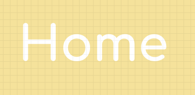

### Passo a passo

#### 1. Adicione a classe simple-action
Dentro do arquivo **404.html** adicione o atributo `class` com o valor `simple-action` nas três primeiras tags `<a>` que estão dentro da tag `<nav>`. O **código da sua `<nav>`** ficará da seguinte forma:

```html
<nav>
  <a class="simple-action" href="">Home</a>
  <a class="simple-action" href="">Pricing</a>
  <a class="simple-action" href="">About Us</a>
  <a href="">Log in</a>
</nav>
```

#### 2. Crie arquivo simple-action.css
Dentro da pasta **css**, temos a pasta **components**. Dentro da pasta **components** adicione um novo arquivo **simple-action.css**, faça isso dentro do VSCode.

Abra o arquivo **404.html** e adicione a tag `<link>` que fará o importe do arquivo que acabamos de criar, essa tag ficará depois do importe do componente `main-logo`. O código que fica dentro do seu `<head>` ficará dessa forma:

<div class="page"/>

```html
<meta charset="utf-8">
<title>Clic.ly - Not found page</title>

<link href="https://fonts.googleapis.com/css?family=Bitter:400,400i,700&display=swap" rel="stylesheet"> 

<link rel="stylesheet" href="css/settings/color.css">
<link rel="stylesheet" href="css/elements/base.css">

<link rel="stylesheet" href="css/components/main-logo.css">
<link rel="stylesheet" href="css/components/simple-action.css">
```

#### 3. CSS do simple-action
Crie o seletor de classes `.simple-action` dentro do arquivo **simple-action.css**:

```css
.simple-action {

}
```

Defina a cor branca para o texto do seletor `.simple-action` usando a propriedade `color` passando para ela a variável `--color-second`. O seletor ficará dessa forma:

```css
.simple-action {
  color: var(--color-second);
}
```

No navegador terá o seguinte resultado:


Remova o traço que fica na base do texto, usando a propriedade `text-decoration` com o valor `none`:

```css
.simple-action {
  color: var(--color-second);
  text-decoration: none;
}
```

<div class="page"/>

Esse é o resultado no navegador:


Abra o arquivo **404.html** e adicione a tag `<link>` a seguir da tag que realiza o importe da fonte *Bitter*. Essa nova tag importará a familía de fonte *Comfortaa*. O código que está **dentro do seu `<head>`** ficará assim:

```html
<meta charset="utf-8">
<title>Clic.ly - Not found page</title>

<link href="https://fonts.googleapis.com/css?family=Bitter:400,400i,700&display=swap" rel="stylesheet"> 
<link href="https://fonts.googleapis.com/css?family=Comfortaa:300,400,500,700&display=swap" rel="stylesheet"> 

<link rel="stylesheet" href="css/settings/color.css">
<link rel="stylesheet" href="css/elements/base.css">

<link rel="stylesheet" href="css/components/main-logo.css">
<link rel="stylesheet" href="css/components/simple-action.css">
```

Importe realizado, volte ao arquivo **simple-action.css** e aplique a fonte *Comfortaa* usando a propriedade `font-family` com o valor `sans-serif`:

```css
.simple-action {
  color: var(--color-second);
  text-decoration: none;
  font-family: 'Comfortaa', sans-serif;
}
```

Você terá o seguinte resultado visual no navegador:


Defina a fonte como negrito usando a propriedade `text-weight` com o valor `bold`:

```
.simple-action {
  color: var(--color-second);
  text-decoration: none;
  font-family: 'Comfortaa', sans-serif;
  font-weight: bold;
}
```

O resultado no navegador será esse:


<div class="page"/>

## Exercício 05 - Componente primary-button
O componente primary-button terá um pouco mais de propriedades comparado com os outro dois que acabamos de criar e ele é um tipo de componente usado em muitos contextos dentro de um site afinal botões estão espalhados em sites da internet, não é mesmo!

### Tarefas
1. Coloque a classe `primary-button` no quarto link da navegação principal do nosso site;
2. Adicione um arquivo novo na pasta **components** chamado **primary-button.css**;
3. Construa todo o CSS necessário no arquivo **primary-button.css** para o componente `primary-button` ficar similar a imagem a seguir, lembre-se das regras de um componente:

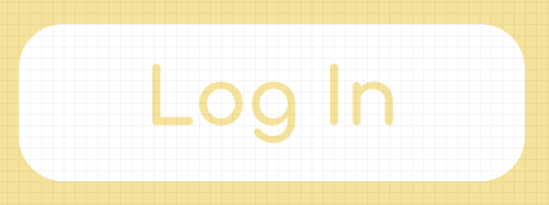

### Passo a passo

#### 1. Adicione classe primary-button
Abra o arquivo **404.html** e adicione o atributo `class` no quarto link do menu principal com o valor `primary-button`. A sua `<nav>` ficará assim:

```html
<nav>
  <a class="simple-action" href="">Home</a>
  <a class="simple-action" href="">Pricing</a>
  <a class="simple-action" href="">About Us</a>
  <a class="primary-button" href="">Log in</a>
</nav>
```
#### 2. Crie o arquivo primary-button.css
Pelo VSCode crie o arquivo **primary-button.css** dentro da pasta **components** que está localizada na pasta **css**.

Abra o arquivo **404.html** e adicione uma tag `<link>` que importará o arquivo que acabamos de criar, essa tag ficará após a tag de importe do componente **simple-action.css**, **dentro do seu `<head>`** você terá o seguinte código:

```html
<meta charset="utf-8">
<title>Clic.ly - Not found page</title>

<link href="https://fonts.googleapis.com/css?family=Bitter:400,400i,700&display=swap" rel="stylesheet"> 
<link href="https://fonts.googleapis.com/css?family=Comfortaa:300,400,500,700&display=swap" rel="stylesheet"> 

<link rel="stylesheet" href="css/settings/color.css">
<link rel="stylesheet" href="css/elements/base.css">

<link rel="stylesheet" href="css/components/main-logo.css">
<link rel="stylesheet" href="css/components/simple-action.css">
<link rel="stylesheet" href="css/components/primary-button.css">
```

#### 3. CSS do primary-button
Dentro do arquivo **primary-button.css** crie um seletor de classe para o componente `primary-button`:

```css
.primary-button {

}
```

Atribua a cor de fundo branca para o componente usando a propriedade `background-color` com o valor `var(--color-second)`:

```css
.primary-button {
  background-color: var(--color-second);
}
```

Veja no seu navegador:


Remova o traço sob o texto usando a propriedade `text-decoration` com o valor `none`:

```css
.primary-button {
  background-color: var(--color-second);
  text-decoration: none;
}
```

<div class="page"/>

No navegador terá o seguinte resultado:


Defina a cor de texto para amarelo usando a propriedade `color` com o valor `var(--color-primary)`:

```css
.primary-button {
  background-color: var(--color-second);
  text-decoration: none;
  color: var(--color-primary);
}
```


Para adicionar bordas arredondadas utilize a propriedade `border-radius` com o valor `4px`:

```css
.primary-button {
  background-color: var(--color-second);
  text-decoration: none;
  color: var(--color-primary);
  border-radius: 4px;
}
```


Mude a família de fonte para a Comfortaa usando a propriedade `font-family` com o valor `'Comfortaa', sans-serif;`:

```css
.primary-button {
  background-color: var(--color-second);
  text-decoration: none;
  color: var(--color-primary);
  border-radius: 4px;
  font-family: 'Comfortaa', sans-serif;
}
```


<div class="page"/>

## Exercício 06 - Primeiro container
Praticamos bastante o conceito de componentes, agora chegou a hora de estudar o conceito de containers. Nosso primeiro container será aplicado na tag `<header>`, um container tem a responsabilidade de juntar os componentes além de posicionar e definir o tamanho, espaçamentos e posicionamento deles no contexto do container. Bora praticar que ficará mais claro tudo que tentei dizer.

### Tarefas
- Crie uma pasta **containers** dentro da pasta **css**;
- Crie um arquivo **main-header.css** dentro da pasta **containers**;
- Adicione a classe `main-header` para a tag `<header>` que temos dentro do `<body>`;
- Crie o CSS necessário para deixar todos os componentes e o próprio container dessa forma:


### Passo a passo

#### 1. Crie pasta containers
Cria a pasta **containers** dentro da pasta **css**.

#### 2. Crie arquivo main-header.css
Crie o arquivo **main-header.css** dentro da pasta **containers**.

Abra o arquivo **404.html** e adicione a tag `<link>` que irá relacionar com o arquivo **main-header.css**, ela ficará depois de todos os `<link>`s dos componentes:

```html
<meta charset="utf-8">
<title>Clic.ly - Not found page</title>

<link href="https://fonts.googleapis.com/css?family=Bitter:400,400i,700&display=swap" rel="stylesheet"> 
<link href="https://fonts.googleapis.com/css?family=Comfortaa:300,400,500,700&display=swap" rel="stylesheet"> 

<link rel="stylesheet" href="css/settings/color.css">
<link rel="stylesheet" href="css/elements/base.css">

<link rel="stylesheet" href="css/components/main-logo.css">
<link rel="stylesheet" href="css/components/simple-action.css">
<link rel="stylesheet" href="css/components/primary-button.css">

<link rel="stylesheet" href="css/contaienrs/main-header.css">
```

<div class="page"/>

#### 3. Adicione a classe main-header
Dentro do arquivo **404.htm** tem uma tag `<header>`, nela adicione a propriedade `class` com o valor `main-header`, sue `<header>` ficará assim:

```html
<header class="main-header">
  <h1 class="main-logo">Clic.ly</h1>

  <nav>
    <a class="simple-action" href="">Home</a>
    <a class="simple-action" href="">Pricing</a>
    <a class="simple-action" href="">About Us</a>
    <a class="primary-button" href="">Log in</a>
  </nav>
</header>
``` 

#### 4. CSS do container
Crie o seletor de class do container `main-header` dentro do arquivo **main-header.css**:

```css
.main-header {
  
}
```

Adicione a propriedade `display` com o valor `flex` para deixar o menu ao lado do logo:

```css
.main-header {
  display: flex;
}
```

No navegador terá um resultado similar: 


<div class="page"/>

Use a propriedade `align-items` com o valor `center` para alinhar o logo e a navegação ao centro:

```css
.main-header {
  display: flex;
  align-items: center;
}
```

Esse é o resultado no navegador:


Use a propriedade `justify-content` com o valor `space-between` para mover o logo para esquerda e o menu para a direita:

```css
.main-header {
  display: flex;
  align-items: center;
  justify-content: space-between;
}
```

Resultado no navegador:


Crie o seletor que pegará apenas o componente `main-logo` quando for um filho direto do container `main-header`, adicione esse seletor após o do `.main-header`:

```css
.main-header {
  display: flex;
  align-items: center;
  justify-content: space-between;
}

.main-header > .main-logo {
 
}
```

<div class="page"/>

Dentro do seletor que acabamos de criar, defina o tamanho de `20px` para o `main-logo` usando a propriedade `main-logo`:

```css
.main-header {
  display: flex;
  align-items: center;
  justify-content: space-between;
}

.main-header > .main-logo {
  font-size: 20px;
}
```

Você terá o seguinte resultado visual no navegador:


<div class="page"/>

## Exercício 07 - Container main-menu
Para finalizar o nosso header, é necessário criar o container `main-menu` que posicionará e definirá o tamanho dos items do menu de navegação principal.

### Tarefas
1. Crie o arquivo **main-menu.css** dentro da pasta **containers**;
2. Crie o arquivo **gap.css** dentro da pasta **settings**;
3. Defina em variáveis os respiros da nossa aplicação no arquivo **gap.css**;
4. Adicione a classe `main-menu` na tag `<nav>` que está dentro do `<header>`;
5. Crie o CSS necessário para deixar o container `main-menu` dessa maneira:

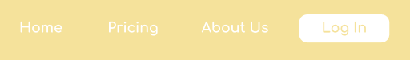

### Passo a passo

#### 1. Crie arquivo main-menu.css
Dentro da pasta **containers** crie o arquivo **main-menu.css**.

Abra o arquivo **404.html** e dentro dele use a tag `<link>` para relacionar o arquivo **main-menu.css**, essa tag ficará antes do container **main-header.css**. O código que está **dentro do seu `<head>`** ficará da seguinte forma:

```html
<meta charset="utf-8">
<title>Clic.ly - Not found page</title>

<link href="https://fonts.googleapis.com/css?family=Bitter:400,400i,700&display=swap" rel="stylesheet"> 
<link href="https://fonts.googleapis.com/css?family=Comfortaa:300,400,500,700&display=swap" rel="stylesheet"> 

<link rel="stylesheet" href="css/settings/color.css">
<link rel="stylesheet" href="css/elements/base.css">

<link rel="stylesheet" href="css/components/main-logo.css">
<link rel="stylesheet" href="css/components/simple-action.css">
<link rel="stylesheet" href="css/components/primary-button.css">

<link rel="stylesheet" href="css/containers/main-menu.css">
<link rel="stylesheet" href="css/containers/main-header.css">
```

<div class="page"/>

#### 2. Crie arquivo gap.css
Crie um arquivo **gap.css** dentro da pasta **settings**, esse arquivo terá variáveis com os espaços (respiros, termo mais usado pelos designers) entre os elementos do nosso layout.

Abra o arquivo **404.html** e adicione a tag `<link>` que importará o arquivo **gap.css**. Ela ficará após o `<link>` do arquivo **color.css** e o conteúdo da sua tag `<head>` ficará assim:

```css
<meta charset="utf-8">
<title>Clic.ly - Not found page</title>

<link href="https://fonts.googleapis.com/css?family=Bitter:400,400i,700&display=swap" rel="stylesheet"> 
<link href="https://fonts.googleapis.com/css?family=Comfortaa:300,400,500,700&display=swap" rel="stylesheet"> 

<link rel="stylesheet" href="css/settings/color.css">
<link rel="stylesheet" href="css/settings/gap.css">
<link rel="stylesheet" href="css/elements/base.css">

<link rel="stylesheet" href="css/components/main-logo.css">
<link rel="stylesheet" href="css/components/simple-action.css">
<link rel="stylesheet" href="css/components/primary-button.css">

<link rel="stylesheet" href="css/containers/main-menu.css">
<link rel="stylesheet" href="css/containers/main-header.css">
```

#### 3. Crie variável de respiro
Dentro do arquivo **gap.css** crie o seletor `:root`:

```css
:root {
  
}
```

No seletor `:root`, adicione a variável `--gap-small` com o valor de `22px`:

```css
:root {
  --gap-small: 22px;
}
``` 

#### 4. Adicione classe main-menu
No arquivo **404.html** adicione o atributo `class` com o valor `main-menu` na tag `<nav>` que está **dentro da tag `<header>`**. Sua tag `<nav>` ficará assim:

```html
<nav class="main-menu">
  <a class="simple-action" href="">Home</a>
  <a class="simple-action" href="">Pricing</a>
  <a class="simple-action" href="">About Us</a>
  <a class="primary-button" href="">Log in</a>
</nav>
```

#### 5. CSS do container main-menu

Crie o seletor que pegará os filhos diretos do container `main-menu` que têm a classe `simple-action`. Repare que tem que ser apenas os **filhos diretos**, portanto será necessário usar o seletor avançado de filho direto que é representado pelo sinal de maior (`>`):

```css
.main-menu > .simple-action {
  
}
```

Utilize a propriedade `margin-right` com o valor `var(--gap-small)` dentro do seletor `.main-menu > .simple-action` para adicionar um *gap* (respiro) externo do lado direito de cada um dos componentes:

```css
.main-menu > .simple-action {
  margin-right: var(--gap-small);
}
```

O resultado no navegador será:


Defina o tamanho da fonte como `12px` usando a propriedade `font-size` dentro do seletor `.main-menu > .simple-action`:

```css
.main-menu > .simple-action {
  margin-right: var(--gap-small);
  font-size: 12px;
}
```

Você verá o seguinte resultado visual no navegador:

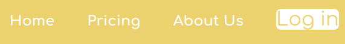

Crie um seletor para pegar o filho direito do container `main-menu` que tem a classe `primary-button`, esse seletor ficará após o seletor `.main-menu > .simple-action`:

```css
.main-menu > .primary-button {

}
```

Defina a propriedade `display` com o valor `inline-block` para que as propriedades `width` e `height` do elemento funcionem e ele continue ao lado dos demais elementos do container `main-menu`:

```css
.main-menu > .primary-button {
  display: inline-block;
}
```

Coloque a fonte com o tamanho de `12px` utilizando a propriedade `font-size` para o componente `primary-button` que é filho direto do container `main-menu`:

```css
.main-menu > .primary-button {
  display: inline-block;
  font-size: 12px;
}
```

O resultado no navegador será:


Adicione a largura de `60px` utilizando a propriedade `width` para o `primary-button` que está dentro do `main-menu`:

```css
.main-menu > .primary-button {
  display: inline-block;
  font-size: 12px;
  width: 60px;
}
```

<div class="page"/>

O resultado no navegador será esse:

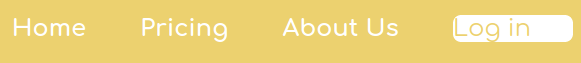

Para centralizar o texto dentro do botão utilizaremos a propriedade `text-align` com o valor `center`, dentro do seletor `.main-menu > .primary-button`:

```css
.main-menu > .primary-button {
  display: inline-block;
  font-size: 12px;
  width: 60px;
  text-align: center;
}
```

Esse é o resultado no seu navegador:

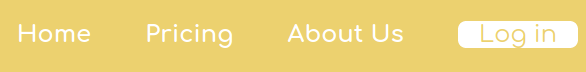

Use a propriedade `height` para definir a altura de `20px` para o componente `primary-button` que é filho direto do container `main-menu`:

```css
.main-menu > .primary-button {
  display: inline-block;
  font-size: 12px;
  width: 60px;
  text-align: center;
  height: 20px;
}
```

Vá no seu navegador e você verá isso:

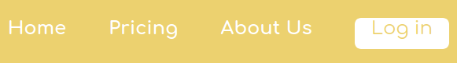

<div class="page"/>

Para o texto do componente `primary-button` também ficar centralizado no eixo vertical deixaremos a altura da linha com a mesma altura da caixa do componente. Use a propriedade `line-height` com o valor de `20px` que é o mesmo valor que definimos na propriedade `height`:

```css
.main-menu > .primary-button {
  display: inline-block;
  font-size: 12px;
  width: 60px;
  text-align: center;
  height: 20px;
  line-height: 20px;
}
```

O layout do container `main-menu` estará assim no seu navegador:

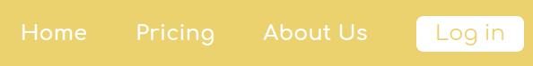

<div class="page"/>

## Desafios top top top

### Básico
Crie todo o HTML que falta para a seção que está após o nosso cabeçalho:
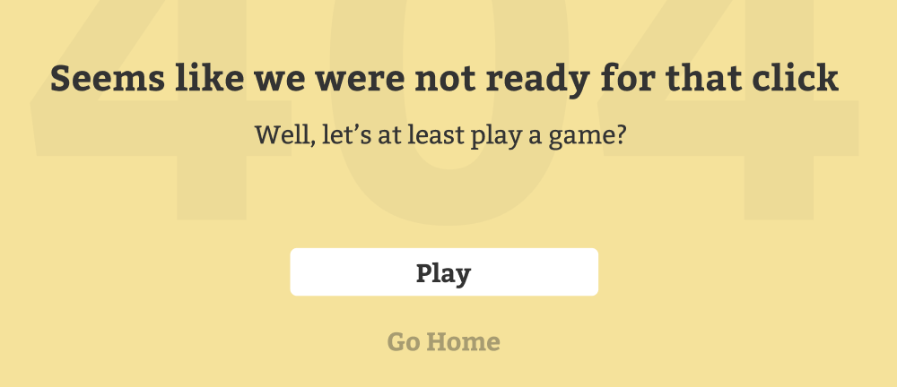

### Intermediário
Crie todo o CSS necessário para que a seção que vem depois do header fique exatamente como está na imagem do desafio básico. Lembre-se de criar os *components* e *containers* necessários para deixar o nosso código simples e feliz para manutenções futuras. Sistema que é fácil de dar manutenção tem um custo mais baixo e é um produto mais competitivo no mercado de trabalho.

### Avançado
Remova ao máximo o CSS que o navegador coloca nas tags, cada navegador escolhe um valor diferente para as propriedades e isso fará com que o nosso layout não funcione igual em navegadores diferentes. Essa técnica é chamada de *reset* CSS (recompor o CSS).

## Gostou, faça uma doação!

Gostou do eBook que a CollabCode criou, você pode tornar mais conteúdos como esse possíveis, ajudando a CollabCode, entre no link a seguir do PicPay e escolha o seu Plano:

[PicPay da CollabCode](http://bit.ly/picpay-collabcode)

<div class="page"/>

# Dia 03 - Treinando HTML e CSS

> *Busque o caminho, não um dedo que te aponte ele...*<br>
> Emicida

## Exercício 01 - Cross Browser com reset CSS
Quando você ouve alguém dizer: *Meu site é cross browser (desculpa não sei traduzir isso)*, essa pessoa está dizendo que o site funciona igual em todos os navegadores. No começo da internet nós tinhamos muitos problemas para manter um site funcionando em múltiplos navegadores e era muito comum você ver escrito no rodapé, algo como: **Site compatível com Internet Explorer**. Felizmente hoje em dia está cada vez mais fácil implementar um site *cross browser*.

O **reset CSS** é uma técnica que nós ajudará a implementar um site *cross browser*, ela é um arquivo chamado **reset.css**, nele teremos apenas seletores de tags, e nesses seletores definimos valores padrões para propriedades que variam entre os navegadores. Por conta disso o `<link>` do **reset.css** tem que vir depois dos importes do **settings**, caso contrário nós estaríamos sobreescrevendo o comportamento de alguns dos nossos componentes e containers. Se não ficou claro para você, fique tranquilo, praticando poderá sanar sua dúvidas, mas se após a prática, ficar algum dúvida não deixe de perguntar em um dos canais da CollabCode:

- [Discord](http://bit.ly/discord-collabcode)
- [Facebook](http://bit.ly/face-html-css-javascript)
- [Telegram](http://bit.ly/telegram-collabcode)

### Tarefas
1. Crie uma pasta **generic** dentro da **css**;
2. Crie um arquivo **reset.css** dentro da pasta **generic**;
3. Dentro do **reset.css** aplique o reset do Eric Meyer. 

### Passo a passo

#### 1. Crie pasta generic
Dentro da pasta **css** crie uma pasta **generic**, dentro dela terá arquivos com seletores CSS com pouco valor de especifidade e é muito comum colocarmos nela o **reset.css**.

#### 2. Crie arquivo reset.css
Crie um novo arquivo **reset.css** e coloque na pasta **generic**.

Abra o arquivo **404.html** e adicione uma tag `<link>` para o **reset.css**, essa tag ficará depois do ultimo importe dos arquivos da pasta **settings**, as tags `<link>` que você tem **dentro do seu `<head>`** ficarão assim:

<div class="page"/>

```html
<link href="https://fonts.googleapis.com/css?family=Bitter:400,400i,700&display=swap" rel="stylesheet"> 
<link href="https://fonts.googleapis.com/css?family=Comfortaa:300,400,500,700&display=swap" rel="stylesheet"> 

<link rel="stylesheet" href="css/settings/color.css">
<link rel="stylesheet" href="css/settings/gap.css">
<link rel="stylesheet" href="css/generic/reset.css">
<link rel="stylesheet" href="css/elements/base.css">

<link rel="stylesheet" href="css/components/main-logo.css">
<link rel="stylesheet" href="css/components/simple-action.css">
<link rel="stylesheet" href="css/components/primary-button.css">

<link rel="stylesheet" href="css/containers/main-menu.css">
<link rel="stylesheet" href="css/containers/main-header.css">
```

#### 3. Reset CSS Eric Meyer
Você pode criar o seu próprio código do **reset.css** mas felizmente a comunidade já fez isso algumas vezes, por esse motivo vamos usar o reset do Eric Meyer. Entre no site a seguir, copie o código do reset CSS e depois cole no seu arquivo **reset.css**. Seu **reset.css** ficará similar ao a seguir, mas por favor use o que está no site porque o que está na apostila pode estar desatualizado.

Site para copiar o reset CSS do Eric Meyer: [https://meyerweb.com/eric/tools/css/reset/](https://meyerweb.com/eric/tools/css/reset/)

<div class="page"/>

```css
/* http://meyerweb.com/eric/tools/css/reset/ 
   v2.0 | 20110126
   License: none (public domain)
*/

html, body, div, span, applet, object, iframe,
h1, h2, h3, h4, h5, h6, p, blockquote, pre,
a, abbr, acronym, address, big, cite, code,
del, dfn, em, img, ins, kbd, q, s, samp,
small, strike, strong, sub, sup, tt, var,
b, u, i, center,
dl, dt, dd, ol, ul, li,
fieldset, form, label, legend,
table, caption, tbody, tfoot, thead, tr, th, td,
article, aside, canvas, details, embed, 
figure, figcaption, footer, header, hgroup, 
menu, nav, output, ruby, section, summary,
time, mark, audio, video {
	margin: 0;
	padding: 0;
	border: 0;
	font-size: 100%;
	font: inherit;
	vertical-align: baseline;
}
/* HTML5 display-role reset for older browsers */
article, aside, details, figcaption, figure, 
footer, header, hgroup, menu, nav, section {
	display: block;
}
body {
	line-height: 1;
}
ol, ul {
	list-style: none;
}
blockquote, q {
	quotes: none;
}
blockquote:before, blockquote:after,
q:before, q:after {
	content: '';
	content: none;
}
table {
	border-collapse: collapse;
	border-spacing: 0;
}
```

<div class="page"/>

Visite o seu site no navegador e terá uma grande surpresa:

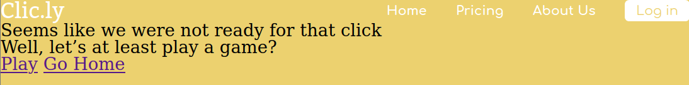

<div class="page"/>

## Exercício 02 - Arrume container main-header
Com a inserção do **reset.css** o container `main-header` está sem *gap* nos lados esquerdo, direito e no topo.

### Tarefas
1. Dentro do **gap.css** crie os novos gaps que usaremos no `main-header`;
2. Use os gaps criados no `main-header`, conforme na imagem a seguir:


### Passo a passo

#### 1. Novos gaps
No arquivo **gap.css** crie uma variável `--gap-smaller` e atribua o valor de `15px`:

```css
:root {
  --gap-smaller: 15px;
  --gap-small: 22px;
}
```

Adicione uma outra variável `--gap-medium` com o valor de `30px`:

```css
:root {
  --gap-smaller: 15px;
  --gap-small: 22px;
  --gap-medium: 30px;
}
```

#### 2. Use gaps no main-header
Abra o arquivo CSS do container `main-header` (**main-header.css**) e adicione a propriedade `padding` com o valor `var(--gap-smaller) var(--gap-smaller) 0` no seletor `.main-header`, dessa forma teremos de volta o respiro do container em relação a página nos lados superior, direito e esquerdo. O código do arquivo ficará assim:

<div class="page"/>

```css
.main-header {
  display: flex;
  align-items: center;
  justify-content: space-between;
  padding: var(--gap-smaller) var(--gap-medium) 0;
}

.main-header > .main-logo {
  font-size: 20px;
}
```

O resultado do site no navegador ficará assim:


<div class="page"/>

## Exercício 03 - Finalize HTML da seção
A seguir do nosso cabeçalho temos uma seção, já começamos a implementar o HTML dela e neste momento está faltando o HTML de um botão e de um link, faremos os dois agora.

### Tarefas
1. No arquivo **404.html** adicione o HTML do botão;
2. Adicione o HTML do link;
3. Use uma tag para envolver todo o conteúdo dessa seção conforme mostrado na imagem a seguir:


### Passo a passo

#### 1. Crie HTML do botão
No arquivo **404.html** adicione uma nova tag `<a>` com o conteúdo `Play`, ela ficará a seguir da tag `<h2>`. O código do seu `<body>` ficará assim:

```html
<header class="main-header">
  <h1 class="main-logo">Clic.ly</h1>

  <nav class="main-menu">
    <a class="simple-action" href="">Home</a>
    <a class="simple-action" href="">Pricing</a>
    <a class="simple-action" href="">About Us</a>
    <a class="primary-button" href="">Log in</a>
  </nav>
</header>

<h1>Seems like we were not ready for that click</h1>
<h2>Well, let’s at least play a game?</h2>
<a href="">Play</a>
```

O resultado no navegador será:


Após o link que acabamos de inserir colocaremos uma nova tag `<a>` com o texto `Go Home`:

```html
<header class="main-header">
  <h1 class="main-logo">Clic.ly</h1>

  <nav class="main-menu">
    <a class="simple-action" href="">Home</a>
    <a class="simple-action" href="">Pricing</a>
    <a class="simple-action" href="">About Us</a>
    <a class="primary-button" href="">Log in</a>
  </nav>
</header>

<h1>Seems like we were not ready for that click</h1>
<h2>Well, let’s at least play a game?</h2>
<a href="">Play</a>
<a href="">Go Home</a>
```

Agora crie uma tag `<section>` que envolverá as 4 tags (`<h1>`, `<h2>` e as duas `<a>`), dessa forma estaremos dizendo ao navegador que essas 4 tags estão relacionadas. Dentro do seu `<body>` você terá o seguinte conteúdo:

```html
<section>
  <h1>Seems like we were not ready for that click</h1>
  <h2>Well, let’s at least play a game?</h2>
  <a href="">Play</a>
  <a href="">Go Home</a>
</section>
```

<div class="page"/>

## Exercício 04 - Crie o componente simple-title
Nós já implementamos todo HTML da seção que fica após o cabeçalho, agora vamos seguir a mesma técnica que fizemos no cabeçalho, onde começamos criando os componentes que estão dentro de um mesmo container e só depois partimos para criação do container em si.

### Tarefas
1. Crie o arquivo **simple-title.css** dentro da pasta **components**;
2. Crie a variável de cor `--color-base` com a cor usada no texto do componente `simple-title`;
3. Adicione a class `simple-title` na tag `<h1>` da `<section>`;
3. Crie o CSS necessário para o componente ficar assim:

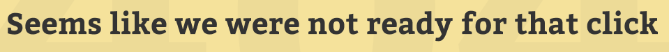

### Passo a passo

#### 1. Crie arquivo simple-title
Dentro da pasta **css** tem uma pasta **components**, nela crie um arquivo **simple-title.css**.

Abra o **404.html** e no `<head>` adicione uma tag `<link>` que fará o importe do arquivo que acabamos de criar, essa tag ficará depois do importe do componente **primary-button**. As tags `<link>`s que estão dentro do seu `<head>` ficarão assim:

```html
<link href="https://fonts.googleapis.com/css?family=Bitter:400,400i,700&display=swap" rel="stylesheet"> 
<link href="https://fonts.googleapis.com/css?family=Comfortaa:300,400,500,700&display=swap" rel="stylesheet"> 

<link rel="stylesheet" href="css/settings/color.css">
<link rel="stylesheet" href="css/settings/gap.css">
<link rel="stylesheet" href="css/generic/reset.css">
<link rel="stylesheet" href="css/elements/base.css">

<link rel="stylesheet" href="css/components/main-logo.css">
<link rel="stylesheet" href="css/components/simple-action.css">
<link rel="stylesheet" href="css/components/primary-button.css">
<link rel="stylesheet" href="css/components/simple-title.css">

<link rel="stylesheet" href="css/containers/main-menu.css">
<link rel="stylesheet" href="css/containers/main-header.css">
```

#### 2. Crie a --color-base
No arquivo **color.css** crie uma variável chamada `--color-base` e atribua o valor `#333333`. O código desse arquivo ficará assim:

```css
:root {
  --color-base: #333333;
  --color-primary: #ecd16f;
  --color-second: #fff;
}
```

#### 3. Adicione class simple-title
Abra o arquivo **404.html** dentro do `<body>` tem uma `<section>` que tem um `<h1>`, nele adicione o atributo `class` com o valor `simple-title` e dessa forma ele ganhará todos comportamentos visuais que definirmos para o componente `simple-title`. O código da `<section>` que está **dentro do seu `<body>`** ficará assim:

```html
<section>
  <h1 class="simple-title">Seems like we were not ready for that click</h1>
  <h2>Well, let’s at least play a game?</h2>
  <a href="">Play</a>
  <a href="">Go Home</a>
</section>
```

#### 4. Crie CSS do simple-title
Dentro do arquivo **simple-title.css** crie um seletor de classe do componente `simple-title`:

```css
.simple-title {
  
}
```

Defina uma cor para o texto do componente `simple-title` usando a propriedade `color` com o valor `var(--color-base)`:

```css
.simple-title {
  color: var(--color-base);
}
```

O resultado visual no navegador será:

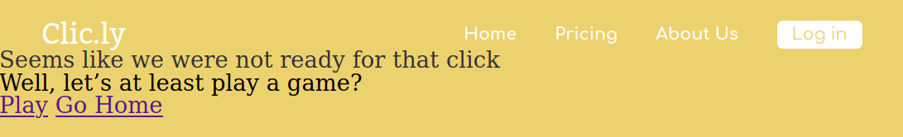

Utilize a propriedade `font-family` com o valor `'Bitter', serif` para alterar a família de fonte do componente:

```css
.simple-title {
  color: var(--color-base);
  font-family: 'Bitter', serif;
}
```

No seu navegador você verá:

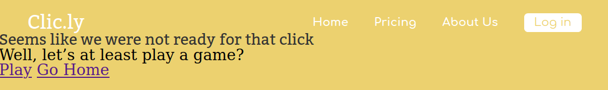

Deixe o texto do componente em negrito usando a propriedade `font-weight` com o valor `bold`:

```css
.simple-title {
  color: var(--color-base);
  font-family: 'Bitter', serif;
  font-weight: bold;
}
```

Esse é o resultado no navegador:


<div class="page"/>

## Exercício 05 - Crie o componente simple-subtitle
Criar componente daqui a pouco será algo simples e feliz para você. Lembre-se de evitar propriedades de posicionamento, tamanho ou espaços em seus componentes, isso deixará eles muito mais reutilizáveis.

### Tarefas
1. Crie o arquivo **simple-subtitle.css** dentro da pasta **components**;
2. Adicione a classe `simple-subtitle` na tag `<h2>` da `<section>`;
3. Crie o CSS necessário para o componente ficar assim:

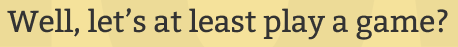

### Passo a passo

#### 1. Crie arquivo simple-subtitle
Dentro da pasta **components** localizada na pasta **css** crie um arquivo chamado **simple-subtitle.css**.

No seu **404.html** adicione uma nova tag `<link>` que fará o relacionamento do arquivo **simple-subtitle.css**, ela ficará após o importe do componente `simple-title`. As tags `<link>` ficam assim:

```html
<link href="https://fonts.googleapis.com/css?family=Bitter:400,400i,700&display=swap" rel="stylesheet"> 
<link href="https://fonts.googleapis.com/css?family=Comfortaa:300,400,500,700&display=swap" rel="stylesheet"> 

<link rel="stylesheet" href="css/settings/color.css">
<link rel="stylesheet" href="css/settings/gap.css">
<link rel="stylesheet" href="css/generic/reset.css">
<link rel="stylesheet" href="css/elements/base.css">

<link rel="stylesheet" href="css/components/main-logo.css">
<link rel="stylesheet" href="css/components/simple-action.css">
<link rel="stylesheet" href="css/components/primary-button.css">
<link rel="stylesheet" href="css/components/simple-title.css">
<link rel="stylesheet" href="css/components/simple-subtitle.css">

<link rel="stylesheet" href="css/containers/main-menu.css">
<link rel="stylesheet" href="css/containers/main-header.css">
```

#### 2. Adicione a class simple-subtitle
Abra o arquivo **404.html** e dentro dele procure a tag `<section>`, dentro dela terá uma tag `<h2>`, nela adicione o atributo `class` com o valor `simple-subtitle`. A tag `<section>` e todo código dela ficará assim:

<div class="page"/>

```html
<section>
  <h1 class="simple-title">Seems like we were not ready for that click</h1>
  <h2 class="simple-subtitle">Well, let’s at least play a game?</h2>
  <a href="">Play</a>
  <a href="">Go Home</a>
</section>
```

#### 3. Crie CSS do componente simple-subtitle
No arquivo **simple-subtitle.css** adicione o seletor de classe para `simple-subtitle`:

```css
.simple-subtitle {
  
}
```

Adicione a propriedade `color` com o valor `var(--color-base)` para alterar a cor do texto do componente `simple-subtitle`:

```css
.simple-subtitle {
  color: var(--color-base);
}
```
O resultado no seu navegador será: 


Para mudar a família de fonte do componente `simple-subtitle` utilize a propriedade `font-family` com o valor `'Bitter', serif`:

```css
.simple-subtitle {
  color: var(--color-base);
  font-family: 'Bitter', serif;
}
```

<div class="page"/>

Visite seu navegador e verá:


<div class="page"/>

## Exercício 06 - Primeira variação do componente
Vamos reutilizar o componente `primary-button` que hoje é usado apenas no cabeçalho dessa forma:


E adicionar o CSS necessário para o mesmo componente funcionar também desta maneira:

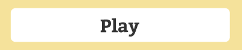

Nós queremos reaproveitar a maior parte dos comportamentos visuais que já existem no componente `primary-button`, o que vamos tratar de forma diferente é a cor do texto e a família de fonte, chamamos isso de **variação**. Vamos aprender a criar uma variação para nosso componente na prática:

### Tarefas
1. Adicione a classe `primary-button` na primeira tag `<a>` que está dentro da `<section>`;
2. Adicione também a classe de variação `-dark` na mesma tag que acabou de adicionar o `primary-button`;
3. Crie o CSS da variação `-dark`.

### Passo a passo

#### 1. Adicione a classe primary-button
Dentro do arquivo **404.html** tem a tag `<section>` que contém uma tag `<a>` com o conteúdo *Play* (jogar), adicione nela o atributo `class` com o valor `primary-button`. O código da `<section>` e de seus filhos, ficará assim:

```html
<section>
  <h1 class="simple-title">Seems like we were not ready for that click</h1>
  <h2 class="simple-subtitle">Well, let’s at least play a game?</h2>
  <a class="primary-button" href="">Play</a>
  <a href="">Go Home</a>
</section>
```

O resultado visual será:

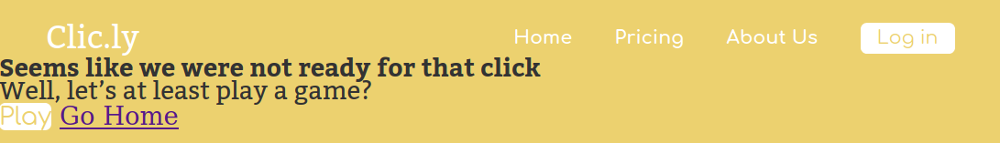

#### 2. Adicione a classe de variação -dark
Toda classe de variação que muda o comportamento padrão de um componente começa com um hífen (-), isso ajuda a leitura do código. Dentro da tag `<a>` que acabamos de adicionar a classe `primary-button` adicione também a classe de variação `-dark`. O resultado do código da `<section>` é esse:

```html
<section>
  <h1 class="simple-title">Seems like we were not ready for that click</h1>
  <h2 class="simple-subtitle">Well, let’s at least play a game?</h2>
  <a class="primary-button -dark" href="">Play</a>
  <a href="">Go Home</a>
</section>
```

Apesar de adicionarmos a classe de variação nada mudou no navegador, isso porque não definimos nenhum comportamento para essa classe no CSS do componente.

#### 3. CSS da variação -dark
Dentro do arquivo **primary-button.css** adicione um seletor que procurará um elemento HTML que tenha duas classes a `primary-button` e a `-dark`, para isso nosso seletor ficará assim: `.primary-button.-dark`.
Repare que no seletor nós temos as duas classes mas não tem nenhum espaço entre elas, isso significa que estamos procurando um elemento que possua as duas ao mesmo tempo. O código do arquivo **primary-button.css** ficará assim:

```css
.primary-button {
  background-color: var(--color-second);
  text-decoration: none;
  color: var(--color-primary);
  border-radius: 4px;
  font-family: 'Comfortaa', sans-serif;
}

.primary-button.-dark {
  
}
```

No seletor que acabamos de criar adicione a propriedade `color` com o valor `var(--color-base)`, dessa forma a variação terá o texto na cor cinza:

<div class="page"/>

```css
.primary-button {
  background-color: var(--color-second);
  text-decoration: none;
  color: var(--color-primary);
  border-radius: 4px;
  font-family: 'Comfortaa', sans-serif;
}

.primary-button.-dark {
  color: var(--color-base);
}
```

Resultado no navegador:

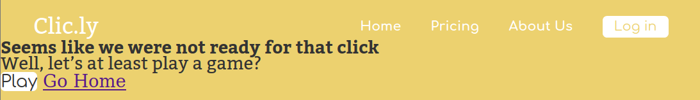

Adicione a propriedade `font-family` com o valor `'Bitter', serif`, para mudar a família de fonte, essa propriedade tem que ser adicionada no seletor da variação do componente que é: `.primary-button.-dark`.

```css
.primary-button {
  background-color: var(--color-second);
  text-decoration: none;
  color: var(--color-primary);
  border-radius: 4px;
  font-family: 'Comfortaa', sans-serif;
}

.primary-button.-dark {
  color: var(--color-base);
  font-family: 'Bitter', serif;
}
```

Esse é o resultado visual no navegador:

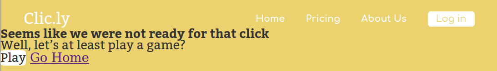

Use a propriedade `font-weight` com o valor `bold` para deixar a fonte em negrito na variação `-dark` do nosso componente `primary-button`:

<div class="page"/>

```css
.primary-button {
  background-color: var(--color-second);
  text-decoration: none;
  color: var(--color-primary);
  border-radius: 4px;
  font-family: 'Comfortaa', sans-serif;
}

.primary-button.-dark {
  color: var(--color-base);
  font-family: 'Bitter', serif;
  font-weight: bold;
}
```

Seu componente `primary-button` que usa a variação `-dark` terá esse resultado no navegador:

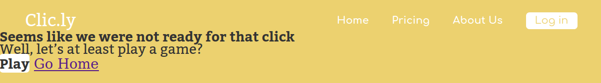

<div class="page"/>

## Exercício 07 - Variação do componente simple-action
Criaremos um variação chamada `-light` para o componente `simple-action`.

### Tarefas
1. Crie uma variável `--color-base-light` com a cor do texto da variação;
2. Adicione a classe `simple-action` na segunda tag `<a>` que está dentro da `<section>`;
3. Adicione também a classe de variação `-light` na mesma tag que acabou de adicionar o `simple-action`;
4. Crie o CSS da variação `-light` para ficar como na imagem a seguir:


### Passo a passo

#### 1. Crie a --color-base-light
Dentro do arquivo **color.css** adicione uma nova variável `--color-base-light` com o valor `rgba(51, 51, 51, 0.4)`. O código do arquivo ficará assim:

```css
:root {
  --color-base: #333333;
  --color-base-light: rgba(51, 51, 51, 0.4);
  --color-primary: #ecd16f;
  --color-second: #fff;
}
```

#### 2. Adicione a classe simple-action
Na segunda tag `<a>` que temos dentro da tag `<section>` adicione a o atributo `class` com o valor `simple-action`, para ela ganhar todos comportamentos do componente `simple-action`. O código da tag `<section>` ficará assim:

```html
<section>
  <h1 class="simple-title">Seems like we were not ready for that click</h1>
  <h2 class="simple-subtitle">Well, let’s at least play a game?</h2>
  <a class="primary-button -dark" href="">Play</a>
  <a class="simple-action" href="">Go Home</a>
</section>
```

<div class="page" />

Esse será o resultado no navegador:

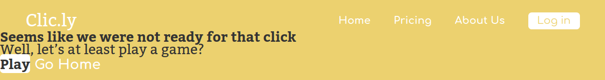

#### 3. Adicione a variação -light
Na mesma tag que acabamos de adicionar a classe `simple-action` adicione também a classe `-light`. O código da `<section>` ficará assim:

```html
<section>
  <h1 class="simple-title">Seems like we were not ready for that click</h1>
  <h2 class="simple-subtitle">Well, let’s at least play a game?</h2>
  <a class="primary-button -dark" href="">Play</a>
  <a class="simple-action -light" href="">Go Home</a>
</section>
```

#### 4. Crie CSS da -light
Abra o arquivo **simple-action.css** e adicione o seletor que procurará um elemento que tenha duas classes ao mesmo tempo, a `simple-action` e a classe de variação `-light`. O código do arquivo do componente `simple-action` ficará assim:

```css
.simple-action {
  color: var(--color-second);
  text-decoration: none;
  font-family: 'Comfortaa', sans-serif;
  font-weight: bold;
}

.simple-action.-light {
  
}
```

Use a propriedade `font-family` como valor `'Bitter', serif` para alterar a família de fonte da variação `-light` do componente `simple-action`:

<div class="page"/>

```css
.simple-action {
  color: var(--color-second);
  text-decoration: none;
  font-family: 'Comfortaa', sans-serif;
  font-weight: bold;
}

.simple-action.-light {
  font-family: 'Bitter', serif;
}
```

O resultado no navegador será esse: 


Mude a cor do texto dentro da variação `-light` usando a propriedade `color` com o valor `var(--color-base-light)`:

```css
.simple-action {
  color: var(--color-second);
  text-decoration: none;
  font-family: 'Comfortaa', sans-serif;
  font-weight: bold;
}

.simple-action.-light {
  font-family: 'Bitter', serif;
  color: var(--color-base-light);
}
```

Resultado no navegador é esse aqui:

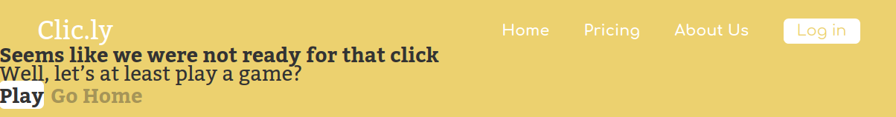

<div class="page"/>

## Exercício 08 - Criar container main-stage
Criaremos o container responsável por posicionar todos os componentes que estão dentro da `<section>` em seus devidos lugares, o nome dele será `main-stage` (palco principal).

### Tarefas 
1. Crie a variável `--gap-big` com o valor do espaço entre o `simple-subtitle` e o `primary-button`;
2. Crie o arquivo **main-stage.css**;
3. Adicione a classe `main-stage` na `<section>`;
4. Crie o CSS necessário do container `main-stage` para deixá-lo assim:


### Passo a passo

#### 1. Crie variável --gap-big
Dentro do arquivo **gap.css** crie uma nova variável `--gap-big` com o valor de `60px`. O código do arquivo ficará assim:

<div class="page" />

```css
:root {
  --gap-smaller: 15px;
  --gap-small: 22px;
  --gap-medium: 30px;
  --gap-big: 60px;
}
```

#### 2. Crie o arquivo **main-stage.css**
Dento da pasta **containers** crie o arquivo **main-stage.css**.

Abra o arquivo **404.html** e adicione uma nova tag `<link>` que será responsável pelo importe do arquivo **main-stage.css**, essa tag ficará depois da tag `<link>` do container `main-header`. As tags `<link>`s que estão dentro do `<head>` ficarão assim:

```html
<link href="https://fonts.googleapis.com/css?family=Bitter:400,400i,700&display=swap" rel="stylesheet"> 
<link href="https://fonts.googleapis.com/css?family=Comfortaa:300,400,500,700&display=swap" rel="stylesheet"> 

<link rel="stylesheet" href="css/settings/color.css">
<link rel="stylesheet" href="css/settings/gap.css">
<link rel="stylesheet" href="css/generic/reset.css">
<link rel="stylesheet" href="css/elements/base.css">

<link rel="stylesheet" href="css/components/main-logo.css">
<link rel="stylesheet" href="css/components/simple-action.css">
<link rel="stylesheet" href="css/components/primary-button.css">
<link rel="stylesheet" href="css/components/simple-title.css">
<link rel="stylesheet" href="css/components/simple-subtitle.css">

<link rel="stylesheet" href="css/containers/main-menu.css">
<link rel="stylesheet" href="css/containers/main-header.css">
<link rel="stylesheet" href="css/containers/main-stage.css">
```

#### 3. Adicione main-stage
No **404.html** tem um tag `<section>` atribua para ela o atributo `class` com o valor `main-stage`. O código da `<section>` ficará assim:

<div class="page" />

```html
<section class="main-stage">
  <h1 class="simple-title">Seems like we were not ready for that click</h1>
  <h2 class="simple-subtitle">Well, let’s at least play a game?</h2>
  <a class="primary-button -dark" href="">Play</a>
  <a class="simple-action -light" href="">Go Home</a>
</section>
``` 

#### 4. CSS do container main-stage
Dentro do arquivo **main-stage.css** crie o seletor da classe `main-stage`. O código do arquivo ficará assim:

```css
.main-stage {

}
```

Adicione a propriedade `display` com o valor `flex` para trabalharmos com o alinhamento dos componentes que estão dentro do container:

```css
.main-stage {
  display: flex;
}
```

Resultado no navegador:

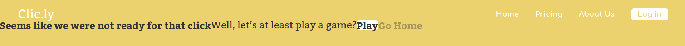

Use a propriedade `flex-direction` com o valor `column` para deixar os componentes do nosso container um abaixo do outro:

```css
.main-stage {
  display: flex;
  flex-direction: column;
}
```

O resultado no navegador é esse: 

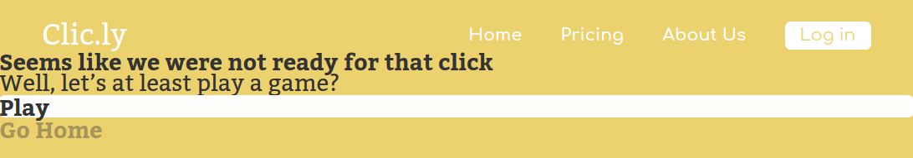

Centralize todos os componentes do container `main-stage` no sentido horizontal (eixo x) usando a propriedade `align-items` com o valor `center`:

```css
.main-stage {
  display: flex;
  flex-direction: column;
  align-items: center;
}
```

Como ficará no navegador:

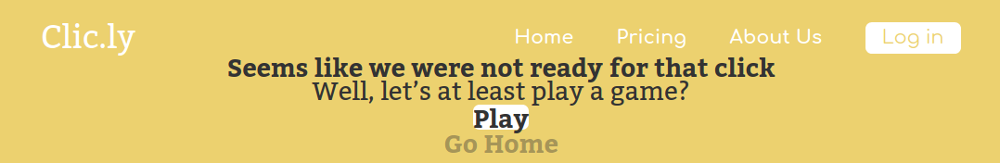

Para centralizar os componentes no sentido vertical utilize a propriedade `justify-content` com o valor `center`:

```css
.main-stage {
  display: flex;
  flex-direction: column;
  align-items: center;
  justify-content: center;
}
```

Atualize o navegador e você terá uma triste surpresa, nada mudou:


Não tivemos alteração visual, usando a propriedade `justify-content` com o valor `center` porque o container `main-stage` não tem uma altura definida, portanto use a propriedade `height` com o valor `80vh`:

```css
.main-stage {
  display: flex;
  flex-direction: column;
  align-items: center;
  justify-content: center;
  height: 80vh;
}
```

Agora sim eles estão centralizados no sentido vertical:

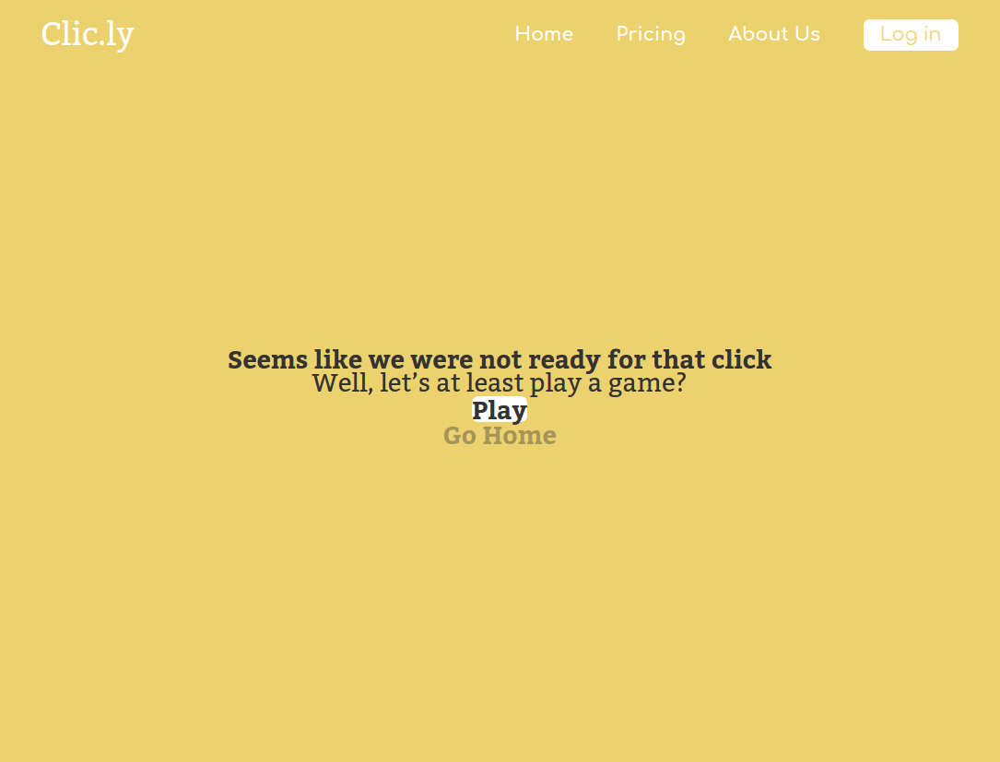

Para adicionar um respiro entre os componentes `.simple-title` e `.simple-subtitle`, primeiro crie o seletor que pegará apenas o componente `.simple-title` que for um filho direto do container `.main-stage`, ele ficará após o seletor do container:

```css
.main-stage {
  display: flex;
  flex-direction: column;
  align-items: center;
  justify-content: center;
  height: 80vh;
}

.main-stage > .simple-title {

}
```

Dentro dele use a propriedade `margin-bottom` com o valor `var(--gap-smaller)`:

<div class="page" />

```css
.main-stage {
  display: flex;
  flex-direction: column;
  align-items: center;
  justify-content: center;
  height: 80vh;
}

.main-stage > .simple-title {
  margin-bottom: var(--gap-smaller);
}
```

Atualize seu navegador:


Entre os componentes `.simple-subtitle` e `primary-button` tem um respiro de `60px`, crie o seletor para pegar o `.simple-subtitle` que seja filho direto do `.main-stage`:

<div class="page" />

```css
.main-stage {
  display: flex;
  flex-direction: column;
  align-items: center;
  justify-content: center;
  height: 80vh;
}

.main-stage > .simple-title {
  margin-bottom: var(--gap-smaller);
}

.main-stage > .simple-subtitle {

}
```

Dentro do seletor que acabamos de criar, adicione a propriedade `margin-bottom` com o valor `var(--gap-big )`:

```css
.main-stage {
  display: flex;
  flex-direction: column;
  align-items: center;
  justify-content: center;
  height: 80vh;
}

.main-stage > .simple-title {
  margin-bottom: var(--gap-smaller);
}

.main-stage > .simple-subtitle {
  margin-bottom: var(--gap-big);
}
```

No seu navegador terá o seguinte resultado visual:


Crie um seletor que pegará o componente `.primary-button` que é filho direto do container `.main-stage`, ele ficará a seguir do componente `.main-stage > .simple-subtitle`: 

```css
.main-stage {
  display: flex;
  flex-direction: column;
  align-items: center;
  justify-content: center;
  height: 80vh;
}

.main-stage > .simple-title {
  margin-bottom: var(--gap-smaller);
}

.main-stage > .simple-subtitle {
  margin-bottom: var(--gap-big);
}
```

<div class="page" />

```css
.main-stage > .primary-button {
  
}
```

Dentro do novo seletor, adicione a largura de `180px` utilizando a propriedade `width`:

```css
.main-stage {
  display: flex;
  flex-direction: column;
  align-items: center;
  justify-content: center;
  height: 80vh;
}

.main-stage > .simple-title {
  margin-bottom: var(--gap-smaller);
}

.main-stage > .simple-subtitle {
  margin-bottom: var(--gap-big);
}

.main-stage > .primary-button {
  width: 180px;
}
```

No navegador terá o seguinte resultado:


Use a propriedade `text-align` com o valor `center` para deixar o texto centralizado no sentido horizontal (eixo x):

```css
.main-stage {
  display: flex;
  flex-direction: column;
  align-items: center;
  justify-content: center;
  height: 80vh;
}

.main-stage > .simple-title {
  margin-bottom: var(--gap-smaller);
}

.main-stage > .simple-subtitle {
  margin-bottom: var(--gap-big);
}

.main-stage > .primary-button {
  width: 180px;
  text-align: center;
}
```

Visite o navegador e terá o resultado a seguir:


Com a propriedade `height` defina a altura do componente `.primary-button` com o valor de `28px`:

```css
.main-stage {
  display: flex;
  flex-direction: column;
  align-items: center;
  justify-content: center;
  height: 80vh;
}

.main-stage > .simple-title {
  margin-bottom: var(--gap-smaller);
}

.main-stage > .simple-subtitle {
  margin-bottom: var(--gap-big);
}
```

<div class="page" />

```css
.main-stage > .primary-button {
  width: 180px;
  text-align: center;
  height: 28px;
}
```

No seu navegador você terá o seguinte resultado:


Para centralizar o texto do botão `.primary-button` no sentido vertical, utilize a propriedade `line-height` (altura da linha) e defina para ela o mesmo valor da altura (`height`) do componente:

<div class="page" />

```css
.main-stage {
  display: flex;
  flex-direction: column;
  align-items: center;
  justify-content: center;
  height: 80vh;
}

.main-stage > .simple-title {
  margin-bottom: var(--gap-smaller);
}

.main-stage > .simple-subtitle {
  margin-bottom: var(--gap-big);
}

.main-stage > .primary-button {
  width: 180px;
  text-align: center;
  height: 28px;
  line-height: 28px;
}
```

Atualizando o navegador, terá o seguinte resultado:


Essa não é a única forma de centralizar o texto de um botão, você também pode usar a propriedade `padding` ou o famoso Flex Box.

Utilize a propriedade `margin-bottom` com o valor com o valor de `var(--gap-smaller)`:

```css
.main-stage {
  display: flex;
  flex-direction: column;
  align-items: center;
  justify-content: center;
  height: 80vh;
}

.main-stage > .simple-title {
  margin-bottom: var(--gap-smaller);
}

.main-stage > .simple-subtitle {
  margin-bottom: var(--gap-big);
}
```

<div class="page" />

```css
.main-stage > .primary-button {
  width: 180px;
  text-align: center;
  height: 28px;
  line-height: 28px;
  margin-bottom: var(--gap-smaller);
}
```

No seu navegador terá o seguinte resultado:


<div class="page" />

Defina o valor de `15px` para o tamanho da fonte utilizando a propriedade `font-size`:

```css
.main-stage {
  display: flex;
  flex-direction: column;
  align-items: center;
  justify-content: center;
  height: 80vh;
}

.main-stage > .simple-title {
  margin-bottom: var(--gap-smaller);
}

.main-stage > .simple-subtitle {
  margin-bottom: var(--gap-big);
}

.main-stage > .primary-button {
  width: 180px;
  text-align: center;
  height: 28px;
  line-height: 28px;
  margin-bottom: var(--gap-smaller);
  font-size: 15px;
}
```

O resultado no navegador será:


Crie um novo seletor que pegue o componente `.simple-action` que seja um filho direto do container `.main-stage`:

```css
.main-stage {
  display: flex;
  flex-direction: column;
  align-items: center;
  justify-content: center;
  height: 80vh;
}

.main-stage > .simple-title {
  margin-bottom: var(--gap-smaller);
}

.main-stage > .simple-subtitle {
  margin-bottom: var(--gap-big);
}
```

<div class="page" />

```css
.main-stage > .primary-button {
  width: 180px;
  text-align: center;
  height: 28px;
  line-height: 28px;
  margin-bottom: var(--gap-smaller);
  font-size: 15px;
}

.main-stage > .simple-action {

}
```

Use a propriedade `font-size` com o valor de `15px` para definir um tamanho de fonte para o componente `.simple-action`:

```css
.main-stage {
  display: flex;
  flex-direction: column;
  align-items: center;
  justify-content: center;
  height: 80vh;
}

.main-stage > .simple-title {
  margin-bottom: var(--gap-smaller);
}

.main-stage > .simple-subtitle {
  margin-bottom: var(--gap-big);
}

.main-stage > .primary-button {
  width: 180px;
  text-align: center;
  height: 28px;
  line-height: 28px;
  margin-bottom: var(--gap-smaller);
  font-size: 15px;
}

.main-stage > .simple-action {
  font-size: 15px;
}
```


<div class="page"/>

## Desafios top top top

### Básico
Crie o HTML do rodapé, conforme a imagem a seguir:


### Intermediário
Crie todo CSS necessário para o rodapé ficar com o resultado visual que está na imagem do desafio **Básico**.

### Avançado
Colocar o 404 que está atrás do conteúdo do container `main-stage`, conforme na imagem a seguir:


## Gostou, faça uma doação!

Gostou do eBook que a CollabCode criou, você pode tornar mais conteúdos como esse possíveis, ajudando a CollabCode, entre no link a seguir do PicPay e escolha o seu Plano:

[PicPay da CollabCode](http://bit.ly/picpay-collabcode)

<div class="page"/>
