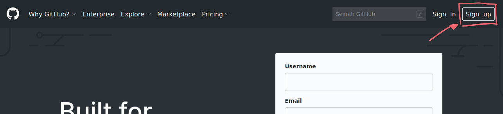
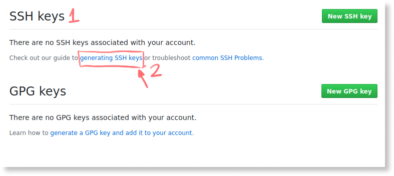

# Sumário

1. Introdução
    1. Objetivo
    1. Onde tirar dúvidas
    1. Como funciona o livro?
    1. Onde acessar o layout do projeto?
1. Dia 1 - Onde tudo começa
    1. Exercício 00 - Prepare o ambiente
    1. Exercício 01 - Inicie projeto
    1. Exercício 02 - Crie o HTML do cabeçalho
    1. Exercício 03 - Estruture o HTML
    1. Exercício 04 - Projeto no GitHub
    1. Desafios top top top
    1. O que terá no Dia 2

<div class="page"/>

# Introdução

Salve (um oi, da periferia de São Paulo)! Tudo bom? Prazer, sou Marco Bruno. Esse livro é free (grátis) e você pode piratear ele à vontade, só não tenta ganhar uns trocados (dinheiro) em cima dele, certo?

Esse livro é um apoio para as aulas free e ao vivo do Mini curso de HTML, CSS e JavaScript que fiz nos dias 9, 10, 11, 12 e 13 de Dezembro pela [twitch.tv/marcobrunobr](https://twitch.tv/marcobrunobr).

## Objetivo

Quero trocar o conhecimento com você sobre **HTML**, **CSS** e **JavaScrit** para você começar seus estudos para o objetivo de ser Developer FrontEnd (pessoa desenvolvedora frontend).

## Onde tirar dúvidas

Todas as suas dúvidas podem ser tiradas nos canais a seguir. Criei um grupo no facebook como uma tentativa de ajudar a galera dos países da África que falam português (Angola, Cabo Verde, Guiné-Bissau, Moçambique, São Tomé e Príncipe e Guiné Equatorial) assim como nós brasileiros e por favor, não envie imagens, vídeos ou links externos porque a galera da África não tem um acesso à internet bom e o que tem é muito caro. É sério! Se alguém está com dúvida no grupo do facebook, por favor responda em texto e direto no facebook, ou simplesmente não responda, deixe para quem tem um bom coração.

- [Discord](http://bit.ly/discord-collabcode)
- [Facebook](http://bit.ly/face-html-css-javascript)
- [Telegram](http://bit.ly/telegram-collabcode)

## Como funciona o livro?

Cada capítulo é um dia de estudo, recomendo você não fazer mais de um capítulo por dia pois é importante deixar a mente respirar para você absorver o conhecimento de forma mais eficiente e feliz.
Esse livro é totalmente prático, é composto só com exercícios.
A **primeira parte** do exercício é chamado de **Tarefas**, que é apenas uma descrição do que deve ser feito. Se está assistindo as vídeo aulas ao vivo pela [twitch.tv/marcobrunobr](https://twitch.tv/marcobrunobr), recomendo você tentar fazer o exercício apenas com as informações passadas na **Tarefas**. Se após uns 5 minutos não conseguir executar o exercício ou em algum momento do exercício travar, você poderá consultar a terceira parte do exercício.
A **segunda parte** é chamada de **Passo a passo**, aqui mostro uma das formas de você chegar no que foi solicitado na **Tarefas**. Se você finalizou o exercício seguindo apenas as instruções da **Tarefas** é provável que seu código estará diferente do apresentado no **Passo a passo** e essa é uma das belezas da programação, não existe um único caminho para solucionar um problema. Seja livre e crítico de forma construtiva com você e todos, não considere que o meu código é melhor que o seu, diferente não é pior.
No final de toda capítulo tem os Desafios top top top, esses desafios é para você validar como está absorvendo o conhecimento das aulas.

Pronto! Agora vai para o seu Dia 1 e se ficar com alguma dúvida fique à vontade para entrar no [Discord](http://bit.ly/discord-collabcode), [Facebook](http://bit.ly/face-html-css-javascript) e [Telegram](http://bit.ly/telegram-collabcode).

<div class="page"/>

## Onde acessar o layout do projeto?

O layout utilizado nesse projeto não foi criado pela comunidade CollabCode, infelizmente não consegui achar o dono dele, caso você consiga por favor não deixe de nos avisar para lhe dar os devidos créditos. Você pode acessar o layout no link a seguir do Figma, é necessário você realizar um cadastro no Figma para ter acesso completo ao layout:

[https://www.figma.com/file/CywyY7njNGI6SfxbDnBOiW/404_error_page?node-id=0%3A25](https://www.figma.com/file/CywyY7njNGI6SfxbDnBOiW/404_error_page?node-id=0%3A25)

<div class="page"/>

# Dia 1 - Onde tudo começa

> *Não precisa sofrer pra saber o que é melhor pra você*<br>
> Parte da música [Não Existe Amor Em SP](https://www.letras.mus.br/criolo/1857556/) de Criolo

## Exercício 00 - Prepare o ambiente
Nesse exercício instalaremos tudo que precisamos para começar nosso estudos em **HTML**, **CSS** e **JavaScript**. Será instalado um editor de texto (*Visual Studio Code* - Estúdio visual de código), um browser (navegador) que será o Fifefox Developer (navegador criado pela Mozilla para pessoas desenvolvedoras) e o Git (sistema de versionamento de código).
O *Visual Studio Code* também conhecido como *VSCode* é o editor de texto mais usado no mercado de trabalho, Firefox Developer é um dos navegadores mais usados pelas pessoas desenvolvedoras e o Git é de longe o sistema de versionamento mais utilizado no mercado de trabalho.

### Tarefas
Entre no sites a seguir e instale o VSCode, o Firefox Developer e o Git:
1. [https://code.visualstudio.com](https://code.visualstudio.com/)
1. [https://www.mozilla.org/en-US/firefox/developer](https://www.mozilla.org/en-US/firefox/developer/)
1. [https://git-scm.com/book/pt-br/v2/Come%C3%A7ando-Instalando-o-Git](https://git-scm.com/book/pt-br/v2/Come%C3%A7ando-Instalando-o-Git)


### Passo a passo
#### 1. Instalar o VSCode

Entre no site [https://code.visualstudio.com](https://code.visualstudio.com/) faça o download (baixar um arquivo) para o SO (Sistema Operacional) que você está usando e em seguida instale-o, se tiver qualquer problema com a instalação não deixe de pedir ajuda em um dos canais da comunidade CollabCode:

- [Discord](http://bit.ly/discord-collabcode)
- [Facebook](http://bit.ly/face-html-css-javascript)
- [Telegram](http://bit.ly/telegram-collabcode)

#### 2. Instalar o Firefox Developer

Acesse o site [https://www.mozilla.org/en-US/firefox/developer](https://www.mozilla.org/en-US/firefox/developer/) realize o download para o SO que você está usando, em seguida faça a instalação, tendo qualquer dúvida fique à vontade mandar suas dúvidas em um dos [canais da CollabCode](01-introducao.md#onde-tirar-dúvidas).

#### 3. Instalar Git

Acesso o eBook do Git no site [https://git-scm.com/book/pt-br/v2/Come%C3%A7ando-Instalando-o-Git](https://git-scm.com/book/pt-br/v2/Come%C3%A7ando-Instalando-o-Git) que lá terá todo processo de download e instalação para o SO que você estiver usando. Ficou com alguma dúvida não deixe de perguntar.

<div class="page"/>

## Exercício 01 - Inicie projeto

### Tarefas
1. Pelo terminal, crie uma pasta com o nome **jokempo** (sem acentuação mesmo) no Desktop (área de trabalho) do seu SO ou em outro lugar que você lembrará que ela estará lá;
1. Entre na pasta do seu projeto usando o terminal e inicie o Git dentro dela;
1. Dentro da pasta **jokempo** crie um pasta **src** (abreviação de source que significa fonte).

### Passo a passo
#### 1. Crie pasta do projeto

Abra o terminal do seu SO, se estiver no Windows use o Power Shell, Git BASH ou similares para que o comando do Linux funcione. Se estiver no Linux ou Mac, ambos têm comandos muitos similares. Agora que você já está com o seu terminal aberto vamos executar os seguintes passos:

Entre no Desktop com o comando a seguir:
```bash
cd ~/Desktop
```

Criar uma pasta chamada **jokempo** dentro do Desktop:
```bash
mkdir jokempo
```

Acessar a pasta **jokempo**:
```bash
cd jokempo
```

> Caso você tenha criado uma pasta com o nome errado você pode usar o comando `rm -r nomeDaPasta` para excluir a pasta e aí só precisa criá-la novamente ou ainda o comando `mv nomeDaPastaErrado nomeDaPastaCerto` para renomear.

#### 2. Iniciar Git

No terminal e dentro da pasta **jokempo** execute o comando a seguir, esse comando criará uma pasta oculta no seu projeto chamada **.git** (toda pasta e arquivos que começam com um ponto são ocultas). Dentro desta pasta ficará tudo sobre o Git que é o sistema de versionamento de arquivos que vamos utilizar durante todo o projeto. Tenha calma se você não sabe o que é Git, teremos um dia para entrar mais a fundo no conhecimento sobre ele.
```bash
git init
```

Se tudo deu certo você receberá uma saída similar no seu terminal:
```bash
Initialized empty Git repository in /home/marcobruno/Desktop/jokempo/.git/
```

Está na dúvida se a pasta **.git** foi criada? Digite o comando a seguir que ele listará todos os arquivos e pasta que tem lá dentro:
```bash
ls -la
```

Terá uma resposta similar a esta no terminal:
```bash
total 12
drwxrwxr-x  3 marcobruno marcobruno 4096 Dec  9 06:38 .
drwxr-xr-x 10 marcobruno marcobruno 4096 Dec  9 06:38 ..
drwxrwxr-x  7 marcobruno marcobruno 4096 Dec  9 06:38 .git
```

#### 3. Crie a pasta **src**:

No terminal e dentro da pasta **jokempo** crie a pasta **src**, nela ficarão todos códigos do nosso projeto:
```bash
mkdir src
```

Rode o comando a seguir e confirme se a pasta **src** foi criada com sucesso:
```bash
ls -la
```

Agora você terá a seguinte resposta no seu terminal:
```bash
total 16
drwxrwxr-x  4 marcobruno marcobruno 4096 Dec  9 06:48 .
drwxr-xr-x 10 marcobruno marcobruno 4096 Dec  9 06:38 ..
drwxrwxr-x  7 marcobruno marcobruno 4096 Dec  9 06:48 .git
drwxrwxr-x  2 marcobruno marcobruno 4096 Dec  9 06:48 src
```

Dúvidas, não deixe de perguntar em um dos [canais da CollabCode](01-introducao.md#onde-tirar-dúvidas).

<div class="page"/>

## Exercício 02 - Crie o HTML do cabeçalho
Nesse exercício vamos entender o que é **HTML**, quais suas responsabilidades e o que é uma tag.

### Tarefas
1. Abrir o VSCode pelo terminal na pasta do projeto;
1. Crie um arquivo **404.html** dentro da pasta **src** que criamos a partir da **jokempo**;
1. Instale a extensão Live Server no VSCode;
1. Dentro do arquivo **404.html** crie o HTML do cabeçado.

> Acesse o layout do projeto em: [https://www.figma.com/file/CywyY7njNGI6SfxbDnBOiW/404_error_page?node-id=0%3A25](https://www.figma.com/file/CywyY7njNGI6SfxbDnBOiW/404_error_page?node-id=0%3A25)

### Passo a passo
#### 1. Acesse o layout

Primeiro acesse o layout do projeto em: [https://www.figma.com/file/CywyY7njNGI6SfxbDnBOiW/404_error_page?node-id=0%3A25](https://www.figma.com/file/CywyY7njNGI6SfxbDnBOiW/404_error_page?node-id=0%3A25). Para ter acesso completo ao layout é necessário você realizar um cadastro no Figma.

> Figma é uma ferramenta para você criar o layout de um site, aplicativo mobile ou sistema web. É umas das ferramentas mais utilizadas pelos Designers, as outras são Sketch e Adobe XD.

#### 2. Abra o VSCode

No terminal já dentro da pasta **jokempo** abra o VSCode com o comando a seguir, esse comando também já nos deixará dentro da pasta do nosso projeto:
```bash
code .
```

> O comando `code` abrirá o VSCode e a seguir dele colamos um ponto, isso significa que queremos abrir o VSCode a partir da pasta que estamos no terminal, no nosso caso a **jokempo**.

#### 3. Crie o arquivo **404.html**

Dentro da pasta **src** que está localizada em **jokempo** crie um arquivo **404.html**, faça isso usando o VSCode. Dentro dele no lado esquerdo tem a árvore de pastas e arquivos do nosso projeto (Explorer), clique com o botão direito do mouse sobre a pasta **src**, depois clique em *New File* (Novo Arquivo).


#### 4. Faça HTML do cabeçalho

Entre no [layout do projeto](https://www.figma.com/file/CywyY7njNGI6SfxbDnBOiW/404_error_page?node-id=0%3A25) e implemente o HTML do cabeçalho do projeto.


> O HTML é uma linguagem de marcação que tem a reponsabiliade de cuidar do conteúdo para o usuário, portanto todo texto, imagem, áudio, vídeo ou qualquer outra representação de conteúdo deverá ficar sobre a responsabilidade do HTML.

Abra o arquivo **404.html** e dentro dele crie o título `Clic.ly` usando a tag de título de primeira importância `<h1>`:
```html
<h1>Clic.ly</h1>
```

Agora precisamos ver o resultado do que acabamos de criar no navegador, para facilitar esse processo vamos instalar uma extensão no VSCode chamada **Live Server** (Servidor ao vivo). Para instalar esta extensão, aperte as teclas *ctrl*, *shift*, *X* juntas (`ctrl + shift + X`), no lugar da nossa árvore de arquivo aparecerá a loja de extesões do VSCode (é loja mas não vamos pagar nada), busque por **Live Server**, depois clique no botão *install* (instalar). Não é necessário reiniciar o VSCode para que o Live Server funcione.


Para usar o Live Server, volte para o Explorer (árvore dos arquivos) e clique com o botão direito do mouse sobre o arquivo **404.html** e depois na opção *Open with Live Server* (Abrir com o Live Server):


Após alguns segundos, automaticamente será aberto o navegador que você definiu como padrão no seu SO. Além disso, toda vez que você salvar o arquivo **404.html** com uma alteração o Live Server também vai atualizar automaticamente o seu navegador. Se tudo deu certo você terá um resultado similar ao a seguir no seu navegador:


Na linha a seguir do nosso título `Clic.ly` vamos implementar o nosso menu de navegação principal que tem 4 itens: Home (página inicial); Pricing (precificação); About Us (sobre nós) e Log in (entrar). Cada item ficará dentro de uma tag `<a>` que utilizamos para representar um link de navegação interna ou externa. Feito o código não esqueça de salvar.

> `<a>` é abreviação de anchor (âncora), é estranho para momento atual, mas no começo da internet usamos o termo **navegar na web** quando estamos utilizando ela.

```html
<h1>Clic.ly</h1>

<a href="">Home</a>
<a href="">Pricing</a>
<a href="">About Us</a>
<a href="">Log in</a>
```

Visite seu navegador e verá que o Live Server já atualizou e desta forma você já pode ver o resultado visual do seu código:


Agora precisamos informar para o navegador que os 4 links que acabamos de colocar, juntos são a navegação do site, para isso utilize a tag `<nav>` (*navitagion* - navegação) envolvendo os 4 links:

```html
<h1>Clic.ly</h1>

<nav>
  <a href="">Home</a>
  <a href="">Pricing</a>
  <a href="">About Us</a>
  <a href="">Log in</a>
</nav>
```

Se for até o navegador verá que nada foi alterado visualmente, mas a tag `<nav>` está lá. Essa é uma tag de estrutura, ela não tem impacto visual, ela ajuda a deixar o seu site mais semântico e dessa forma ajuda para acessibilidade e SEO (*Search Engine Optimization* - Otimização para motores de busca).

> Criar um HTML semântico, significa que você está usando cada tag com o propósito pelo qual ela foi criada. Dessa forma você torna o seu site mais acessível e te ajudará com o SEO.

> Quando o seu site tem um bom SEO (*Search Engine Optimization* - Otimização para motores de busca), significa que você trabalhou para deixar ele otimizado para buscadores como o Google. Para aparecer em primeiro na busca orgânica do Google não basta somente ter um HTML semântico mas isso ajuda bastante.

> Acessibilidade é obrigatório nos sites, tem leis sobre isso e se não seguir os padrões você poderá ser processado, recomendo seguir o [checklist de acessibilidade para desenvolvedores](https://www.gov.br/governodigital/pt-br/acessibilidade-digital/emag-checklist-acessibilidade-desenvolvedores.pdf/view) criado pelo governo brasileiro, se não tiver no Brasil procure ver as leis do seu país.

<div class="page"/>

Bora melhorar ainda mais a semântica do nosso cabeçalho usando a tag `<header>` (cabeçalho) que deve envolver o nosso título e a navegação:

```html
<header>
  <h1>Clic.ly</h1>

  <nav>
    <a href="">Home</a>
    <a href="">Pricing</a>
    <a href="">About Us</a>
    <a href="">Log in</a>
  </nav>
</header>
```

Se visitar novamente o navegador, verá que não teve muito impacto visual, mas novamente deixamos o nosso site mais acessível e com um SEO mais feliz, trabalhando uma melhor semântica no HTML. 

Pronto! Entregamos o HTML do nosso cabeçalho. Se ficou alguma dúvida, só tirar em algum dos [canais da CollabCode](01-introducao.md#onde-tirar-dúvidas).

<div class="page"/>

## Exercício 03 - Estruture o HTML
Nossa página já esta funcionando, mas podemos deixá-la mais organizada com algumas tags de estrutura e configuração.

### Tarefas
1. Alterar o título da aba do navegador para *Clic.ly - Not found page* (Clic.ly - página não existe)

1. Fazer com que letras com ê, ç e ã funcione em todos os navegador;
1. Separar o que é configuração do que é conteúdo;
1. Informar a versão do HTML para o navegador.

### Passo a passo
#### 1. Mude conteúdo da aba do navegador
Para adicionar o conteúdo *Clic.ly - Not found page* como conteúdo da aba do navegador, use a tag `<title>` antes do tag `<header>`:

```html
<title>Clic.ly - Not found page</title>

<header>
  <h1>Clic.ly</h1>

  <nav>
    <a href="">Home</a>
    <a href="">Pricing</a>
    <a href="">About Us</a>
    <a href="">Log in</a>
  </nav>
</header>
```

Salve e visite o navegador que terá um resultado semelhante a este:


#### 2. Faça funcionar o ç e letras com acentuação
Para as letras ê, ç e ã funcionarem, use a tag `<meta>` com o atributo `charset` e passe para ele o valor `utf-8`. Essa tag ficará antes da tag `<title>`:

```html
<meta charset="utf-8">
<title>Clic.ly - Not found page</title>

<header>
  <h1>Clic.ly</h1>

  <nav>
    <a href="">Home</a>
    <a href="">Pricing</a>
    <a href="">About Us</a>
    <a href="">Log in</a>
  </nav>
</header>
```

> `utf-8` é uma tabela de caracteres que suporte a maior parte dos idiomas do mundo, então caso você precise fazer um site que funcione em português e japonês ela dará conta.

> A tag `<meta>` é bem genérica, você usará ela em outros contextos mas agora utilizamos para definir uma tabela de caracteres com o atributo `charset` (conjunto de caracteres).

#### 3. Separe a configuração do conteúdo
Tem duas grandes categorias de tags no código, uma que é a configuração e o navegador fica com o controle dela e a segunda é o conteúdo e você tem mais controle. As tags de configuração (`<meta>` e `<title>`) ficarão dentro da tag `<head>` (cabeça) e a de conteúdo (`<header>` e tudo que está dentro dela) ficarão dentro da tag `<body>` (corpo):

```html
<head>
  <meta charset="utf-8">
  <title>Clic.ly - Not found page</title>
</head>
<body>
  <header>
    <h1>Clic.ly</h1>

    <nav>
      <a href="">Home</a>
      <a href="">Pricing</a>
      <a href="">About Us</a>
      <a href="">Log in</a>
    </nav>
  </header>
</body>
```

Daqui para frente vamos respeitar essas duas grandes categorias do HTML, tudo que for conteúdo para o usuário deverá ficar dentro da tag `<body>` e o que for configuração deverá ficar dentro da tag `<head>`.

Outra tag de estrutura é a tag `<html>` que envolve tanto a tag `<head>` quando a tag `<body>`, cole ela também no seu código:

```html
<html>
  <head>
    <meta charset="utf-8">
    <title>Clic.ly - Not found page</title>
  </head>
  <body>
    <header>
      <h1>Clic.ly</h1>

      <nav>
        <a href="">Home</a>
        <a href="">Pricing</a>
        <a href="">About Us</a>
        <a href="">Log in</a>
      </nav>
    </header>
  </body>
</html>
```

<div class="page"/>

#### 4. Informe a versão do HTML
Tivemos algumas versão do HTML, as três últimas foram **HTML4**, depois **XHTML** e hoje estamos na **HTML5**. Para pedir ao navegador para utilizar o **HTML5**, coloque na primeira linha do **404.html** `<!DOCTYPE html>`:

```html
<!DOCTYPE html>
<html>
  <head>
    <meta charset="utf-8">
    <title>Clic.ly - Not found page</title>
  </head>
  <body>
    <header>
      <h1>Clic.ly</h1>

      <nav>
        <a href="">Home</a>
        <a href="">Pricing</a>
        <a href="">About Us</a>
        <a href="">Log in</a>
      </nav>
    </header>
  </body>
</html>
```

> `<!DOCTYPE html>` não significa apenas que é pro navegador usar o HTML5, na verdade estamos falando para ele usar a última versão estável do HTML, se amanhã for o HTML6 não precisaremos mais mudar o `<!DOCTYPE html>` o próprio navegador dará conta do recado.

<div class="page"/>

## Exercício 04 - Projeto no GitHub
Se você quiser compartilhar o código do seu projeto com outros desenvolvedores ou guardar o código por segurança, é recomendado salvá-lo em algum lugar que não seja sua máquina. GitHub é o maior serviço de hospedagem de códigos do mundo que usa o Git como sistema de versionamento. Projetos *opensource* (código aberto) como React, Svelte, Angular, Vue e muitos outros estão no GitHub além da maior parte da empresas usarem ele, por esses motivos vamos usá-lo também. Tem muitas outras vantagens em usar o Git e GitHub, mas vamos conhecendo outras com o decorrer do projeto.

### Tarefas
1. Criar um conta no GitHub;
2. Criar um repositório do projeto;
3. Criar e adicionar uma SSH key no GitHub;
4. Associar projeto local com o remoto do GitHub;
5. Configurar o git localmente;
6. Adicionar arquivos para serem enviados para o repositório;
7. Guardar estado do código e enviar para o GitHub;
8. Enviar o código para o repositório remoto do GitHub.

### Passo a passo
#### 1. Crie conta no GitHub
Entre no site [https://github.com](https://github.com) clique no link *Sign up* (inscrever-se):



Preencha os campos *Username* (nome do usuário), *Email address* (Endereço de email), *Password* (senha), resolva o puzzle (enigma) e por último clique no botão azul com o texto *Next: Select a plan*:


Depois você terá que escolher o plano do GitHub, não é necessário contratar nenhum plano no começo dos estudos, então escolha a opção free.

**Obs.** Se não aparecer a tela dos planos, só clique no logo do GitHub que fica no topo do lado direito para sair da tela que você está, fique tranquilo se entrou nessa tela o próprio GitHub definiu que sua conta é a versão free.


Se tudo der certo você verá a tela de boas-vindas do GitHub:


#### 2. Crie um repositório
No lado direito e no topo da tela de boas-vindas tem um sinal de **mais** (+), clique nele e depois na opção *New repository* (Novo repositório):


Se você cair na tela a seguir, primeiro precisa confirmar seu email e só depois poderá criar um repositório:


Agora que seu email já está confirmado, precisa informar *Repository name* (Nome do repositório), *Description* (Descrição), definir com *Public* (Público) e depois clicar no botão verde com o texto *Create repository* (Criar repositório):


Se chegou na tela a seguir, significa que conseguiu criar um repositório remoto para o seu projeto:


#### 3. Crie e adicione a chave SSH no GitHub

Agora é possível associar o repositório local (pasta do nosso projeto que rodamos o comando `git init`) com o repositório remoto (o que criamos agora no GitHub). Tem duas formas de criar essa associação, **https** e **ssh**, a mais usada é a segunda por ser mais segura e também pela facilidade no dia a dia já que com o **ssh** não é necessário ficar digitando usuário e senha toda vez que quiser atualizar o repositório remoto, em vez da senha o ssh envia para o GitHub um *SSh key* (chave que você cria e é segura e criptografada). 

É exatamente a chave que você criará agora então volte no GitHub. Na parte superior direita da tela, ao lado direito do sinal de **mais** tem um emoji não muito bonito (que é onde deveria aparecer a sua foto), clique nele e depois em *Settings* (configurações):


Agora você está nas configurações do seu usuário no GitHub, no lado esquerdo tem algumas opções, clique na *SSH and GPG keys* (chaves SSH e GPG):


Ao lado direito do menu de navegação apareceu duas seções, a primeira se chama *SSH keys*, nela tem um link com o texto *generating SSH keys* (gerando chaves SSH) clique nele:



Você será redirecionado para uma nova página e nela terá o link com o texto *Generating a new SSH key and adding it to the ssh-agent* (Gerando uma nova chave SSH e adicionando-a ao ssh-agent), clique nele:


Na nova página terá o processo para você criar a sua chave SSH pelo terminal, primeiro escolha o SO que você está e depois siga o processo, se tiver dificuldade com inglês como eu, abra o translate e não deixe de aprender. Faça apenas o processo da seção *Generating a new SSH key* (Gerando uma nova chave SSH).


Você acabou de gerar a chave pública e privada para o GitHub, no terminal rode o comando a seguir que exibirá o conteúdo da chave pública no terminal:

```bash
cat ~/.ssh/id_rsa.pub
```

<div class="page"/>

Copie a saída que apareceu no terminal que será similar a que está a seguir:

```bash
ssh-rsa KSAJDFHAKSJHuHfBaNcSa/zd1OSFAr9OqInetBapQF3oVeInJdpGk/n8zqHHR2HJKYfpxiMKPLVD9sicL5IwLIUhuMWLDjDhFIHOls9z2ofdxt6vQgrHz+teLraltn4yKQhe6vdiLVKar9O+dklfajhflkjheuna8dsiufnbwebasdMTMzQFeeJbOcQejmMIEvsKa0mgKFJ/sadhfaisuhfisaufnueeeeakfj;lda2gNtAyY9jy48Hoba6mtyf3SGSRs6AmKYluIAe4+xAV7Iqf2z/wGBTGDL+HGnj8IXpeD8LAGc4YeOUh1yawOqan9S9lm6Ci8+g3/
XRO8m+KBoEzofl43qOezEi/IbaLSpVAjadic5w8KpZS/Hr4dK+1MXD/AWB1TE67R+sJ+eDk4msAX0yKOfEl2a/BgBMtlG/+hGf6s3DSgsw== marco.bruno.br@gmail.com
```

**Importante:** Você deve copiar o conteúdo inteiro que começa com **ssh-rsa** e termina com **seu e-mail**!

Volte nas configurações do GitHub na parte do *SSH Keys* e clique no botão verde que está no lado direito com o texto *New SSH key* (Nova chave SSH):


Preencha o *Title* (Título) da sua chave SSH, depois cole-a no campo *Key* (Chave) e para finalizar clique no botão verde com o texto *Add SSH Keys* (Adcionar chave SSH):


Se tudo deu certo, você verá uma tela similar a essa:


#### 4. Associe projeto local com repositório remoto do GitHub

Volte na tela do repositório que criamos no começo do exercício, nela terá um botão com o nome de SSH, clique nele depois em um ícone que copiará a URL SSH do repositório: 


Abra o terminal, dentro da pasta do projeto **jokempo** execute o comando a seguir que associará o nosso projeto local com o repositório remoto do GitHub:
```bash
git remote add origin https://github.com/marcobruno-exemplo/jokempo.git
```

#### 5. Configurar o git localmente

Rode os comandos a seguir para configurar o nome (`user.name`) e o e-mail (`user.email`) que devem aparecer toda vez que você for guardar o estado do seu código:

```bash
git config --global user.name "Seu nome"
git config --global user.email "seu.email@exemplo.com"
```

Para ver que tudo foi configurado corretamente, rode o comando abaixo:

```bash
git config -l
```

Se tudo ocorreu bem você verá uma saída similar a esta:

```
user.name=Marco Bruno
user.email=marco.bruno.br@gmail.com
```

#### 6. Adicione os arquivos que você alterou

Execute o comando a seguir para adicionar o arquivo que foi alterado na lista de arquivos que devem ser enviados para o repositório remoto do GitHub:

```bash
git add src/404.html
```

Para verificar se foi adicionado, rode o comando abaixo:

```bash
git status
```

Aparecerá uma saída parecida com esta:

```
On branch master
Your branch is up to date with 'origin/master'.

Changes to be committed:
  (use "git reset HEAD <file>..." to unstage)

	modified:   src/404.html
```

#### 7. Guarde o estado do código

Rode o comando a seguir, ele guardará o estado do código como está agora, isso dará a você o poder de máquina do tempo para o seu código:
```bash
git commit -m "Crie o HTML do cabeçalho"
```

> O comando `commit` com o parâmetro `-m` posibilita você adicionar uma mensagem para esse momento do código, dessa forma se precisar voltar nesse momento do código ficará mais fácil para achar. O texto da mensagem de `commit` sempre fica no imperativo, se possível em inglês mas se você não sabe inglês não se preocupe com isso nesse momento, você está começando a aprender programação, mas o conhecimento de inglês é bem importante uma vez que você quer ser programador. Para saber mais sobre a mensagem de commit, [leia o post do Lucas Caton](https://www.lucascaton.com.br/2017/10/16/como-escrever-mensagens-de-commits-no-git).

<div class="page"/>

#### 8. Envie o código para o repositório remoto do GitHub

Execute o comando a seguir, ele enviará o código para o repositório remoto que associamos com o comando `git remote add`, anteriormente nesse exercício:
```bash
git push
```

Como você está executando o comando `git push` pela primeira vez, é necessário associar a sua *branch* (ramificação) local com uma do repositório remoto, por isso receberá a seguinte mensagem de erro:
```bash
fatal: The current branch master has no upstream branch.
To push the current branch and set the remote as upstream, use

    git push --set-upstream origin master
```

A parte legal é que o próprio git já te oferece a solução para o erro que é o comando `git push --set-upstream origin master`, mas você pode usar um comando menor para chegar no mesmo resultado que é:
```bash
git push -u origin master
```

Por favor, por enquanto não se preocupe o que é *branch*, mais pra frente te explico com mais calma. Nos próximos envios para o repositório remoto não será mais necessário usar o comando `git push -u origin master`, só o comando `git push` será o suficiente.

<div class="page"/>

## Desafios top top top
Os desafios top top top são para você tentar implementar junto com seu grupo de estudo ou só você. Recomendo você convidar uma pessoa para estudar junto com você, ao menos isso me ajuda bastante para ter outro ponto de vista e me motiva bastante ter uma pessoa comigo no mesmo caminho. Se não tiver não deixe de fazer por sua conta.
Esses desafios são para você validar como foi a sua absorção do conhecimento passado na aula e também tentar evoluir um pouco sem ajuda.

### Básico
Desafio básico é sempre algo que expliquei na aula e é considerado de fácil implementação:
- Crie o HTML do título do 404, conforme a imagem a seguir. Lembre-se que você pode ver tudo no [layout do projeto](https://www.figma.com/file/CywyY7njNGI6SfxbDnBOiW/404_error_page?node-id=0%3A25) que está no Figma.


### Intermediário
O desafio intermediário é um pouco mais complicado, mas com o conhecimento que passei na aula é suficiente para implementar, onde apenas mudo um pouco o contexto. Depois do dia 2 esse desafio pode ter conteúdo de várias aulas.
- Crie o subtítulo do 4040, conforme está na imagem a seguir.


### Avançado
É algo que não expliquei na aula e você precisará implementar por conta e também correr atrás do conhecimento. Mas tenha calma se não conseguir executar um dos desafios porque no dia seguinte implementarei todos os desafios.
- Faça o CSS do cabeçalho e também deixe a pagina toda amarela, conforme na imagem a seguir.


## O terá no Dia 2
Além de implementar os desafios top top top, vamos implementar seção principal e ficará faltando apenas o rodapé na página inicial.
